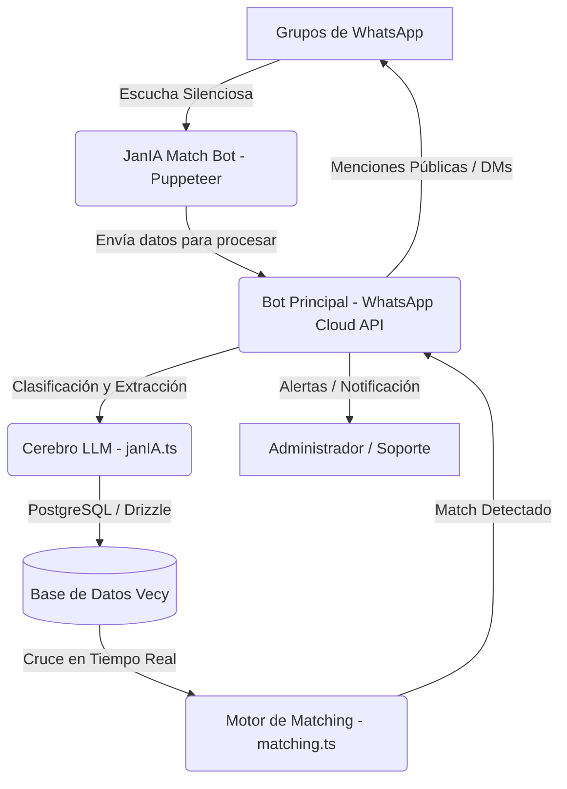

# Manual de Arquitectura y Decisiones Técnicas de JanIA 🤖🏛️
_Documento técnico de referencia persistente para el desarrollo y mantenimiento del ecosistema VECY Network._

---

## 1. Filosofía y Propósito del Sistema
**JanIA** es la mente estratégica central de **VECY Network**, la primera red inmobiliaria colaborativa inteligente de Colombia que opera de forma nativa en WhatsApp. Fue concebida por **Eduardo A. Rivera** (Arquitecto Tecnológico) y **Jani Alves**, diseñada para ser una socia comercial y técnica del asesor inmobiliario colombiano, facilitando el registro de inmuebles, la detección de requerimientos y el cruce de negocios en tiempo real (matching) sin comisiones obligatorias por parte de la plataforma.

---

## 2. Arquitectura de Componentes
El ecosistema técnico de JanIA está compuesto por los siguientes módulos integrados en la carpeta `server/_core/`:

### A. Bot Principal (WhatsApp Cloud API - Meta)
*   **Archivo**: [whatsapp.ts](file:///home/eddu/Proyectos/vecy-network/server/_core/whatsapp.ts)
*   **Número**: `+57 3185462265` (JanIA v3.5 - Soporte e Interacción Directa)
*   **Tecnología**: Integración directa con los Webhooks oficiales de Meta WhatsApp Cloud API.
*   **Propósito**: Envío de respuestas oficiales, solicitudes de datos faltantes (`DATOS_INCOMPLETOS`), alertas de infracción, mensajería de soporte directo (DMs privados) y envío de audios mediante notas de voz.
*   **Nota de Diseño**: No utiliza Puppeteer para las respuestas salientes a usuarios a gran escala, eliminando de raíz el riesgo de baneo de Meta en este número principal.

### B. Bot Ojos y Oídos (JanIA Match Bot)
*   **Archivo**: [whatsapp-match.ts](file:///home/eddu/Proyectos/vecy-network/server/_core/whatsapp-match.ts)
*   **Número**: `+57 3223019130` (JanIA Match)
*   **Tecnología**: WhatsApp Web automatizado con Puppeteer (`whatsapp-web.js`) empleando técnicas de evasión de firmas (`Stealth`) y optimización de rendimiento (bloqueo de descarga de imágenes/recursos visuales para ahorro de memoria en el VPS).
*   **Propósito**: Monitorea de forma 100% silenciosa los grupos de WhatsApp configurados en la variable de entorno `JANIA_MATCH_GROUPS`. Capta ofertas de propiedades, requerimientos y archivos PDFs, redirigiendo el flujo al bot principal.
*   **Regla de Redirección**: Si un usuario chatea por privado con este número, el bot responderá una vez al día dirigiéndolo a interactuar con la versión principal de soporte (+57 3185462265) a través del enlace: `https://wa.me/573185462265`.

### C. Cerebro de Inteligencia Artificial (LLM)
*   **Archivo**: [janIA.ts](file:///home/eddu/Proyectos/vecy-network/server/_core/janIA.ts)
*   **Modelos Activos**: 
    *   Procesamiento general: `gemini-2.5-flash` o `gemini-3.1-flash-lite` (llamado a través de `invokeLLM`).
    *   Generación de notas de voz: `gemini-3.1-flash-tts-preview` vía Google Cloud Text-to-Speech API.
*   **Propósito**: Clasifica los mensajes entrantes (en categorías como `INMUEBLE`, `REQUERIMIENTO`, `DATOS_INCOMPLETOS`, `VIOLACION_DE_NORMAS`, `CONSULTA_GENERAL`), extrae fichas técnicas estructuradas y valida datos geográficos (ciudades y barrios de Colombia) y fonéticos del español.

### D. Motor de Matching y Base de Datos (Drizzle ORM)
*   **Archivos**: `server/db.ts`, [schema.ts](file:///home/eddu/Proyectos/vecy-network/drizzle/schema.ts) y [matching.ts](file:///home/eddu/Proyectos/vecy-network/server/_core/matching.ts)
*   **Tecnología**: PostgreSQL con Drizzle ORM como capa relacional.
*   **Propósito**: Registra las entidades inmobiliarias extraídas (`properties` y `requirements`) y ejecuta búsquedas de emparejamiento semántico/numérico en tiempo real al insertar un registro. Si el `matchScore` es mayor o igual a **70%**, se activa una alerta automática de negocio viable.
*   **Regla de Desduplicación**: Si un usuario vuelve a publicar un inmueble o requerimiento, el sistema no duplica la fila en la base de datos; en su lugar, detecta el número de teléfono y el tipo del activo y actualiza los campos modificados (como precio, administración o descripción).

---

## 3. Reglas de Negocio Estrictas e Inquebrantables

### 🎙️ Voz Oficial de JanIA
*   **Proveedor**: **Google Cloud Text-to-Speech (TTS) API (v1beta1)**.
*   **Configuración obligatoria**:
    *   `modelName`: `"gemini-3.1-flash-tts-preview"`
    *   `name`: `"Achernar"` (idioma `es-us`)
    *   `prompt` de estilo: `"Leer en voz alta con un tono cálido y acogedor."`
    *   `speakingRate`: `1.1`
*   **Formatos**:
    *   Para WhatsApp: Codificación `OGG_OPUS` (se reproduce nativamente como nota de voz humana).
    *   Para Videos Comerciales / Scripting: Codificación `MP3`.
*   **Prohibición**: Queda terminantemente prohibido proponer o utilizar ElevenLabs o voces sintéticas estándar de Google. Para generar audios MP3 en el proyecto, debe utilizarse el script utilitario local:
    `npx tsx scratch/generar_voz_jania.ts "Texto"`

### 📈 Comisiones e Inteligencia de Arrendamientos
*   **Comisión en Arrendamientos**: En Colombia, la costumbre mercantil para comisiones en arrendamientos es de **un canon de arriendo mensual** (o porcentaje correspondiente en contratos de larga duración). JanIA no debe calcular comisiones de arriendo basándose en el 3% de ventas.
*   **Desglose de Administración (admon)**: En arriendos, es obligatorio saber si el canon incluye o no la administración:
    *   Si no se especifica en el mensaje, JanIA está instruida a preguntar activamente: *¿el valor de la administración está incluido en el canon o cuánto es?*
    *   El campo `adminFee` se mapea explícitamente en la base de datos en la columna `adminFee` como `decimal` y se captura en el esquema del LLM.

### 🛡️ Moderación Híbrida Inteligente (Mitigación de Baneos)
Para evitar que los usuarios del grupo reporten el bot principal como spam debido a mensajes privados no solicitados, se aplica la siguiente directriz híbrida:
*   **Advertencias por Datos Incompletos (`DATOS_INCOMPLETOS`)**:
    *   *Usuario Conocido* (con historial de chat previo con el bot): Se le envía la solicitud de completar datos de forma silenciosa por privado (DM).
    *   *Usuario Nuevo* (sin interacción previa): Se le advierte **públicamente en el grupo** mediante una mención, invitándolo a iniciar el chat con el bot en `https://wa.me/573185462265` para completar su registro.
*   **Infracciones de Normas (`VIOLACION_DE_NORMAS`)**: Siempre se alertan de forma pública en el grupo etiquetando al remitente para educar a la comunidad.

### ⚖️ Superpoderes Legales y de Valoración Comercial
Para dar un valor excepcional a la comunidad, JanIA cuenta con capacidades avanzadas de asesoría jurídica inmobiliaria y estimación comercial de mercado:
*   **Abogacía de Élite y Firma Electrónica**:
    *   Conoce el Código Civil y Código de Comercio colombianos, Ley 820 de 2003 y Ley 675 de 2001.
    *   Asesora sobre firma electrónica (Ley 527 de 1999 / Decreto 2364 de 2012) y recomienda el portal estatal gratuito: `https://autenticaciondigital.and.gov.co/`.
*   **Doctrina Legal de Correo Electrónico vs. WhatsApp (CRÍTICO)**:
    *   Explica que WhatsApp (Ley 2213 de 2022) exige costosos peritajes técnicos digitales forenses para ser prueba plena en disputas, y corre riesgo de borrado. El correo electrónico, con sus logs SMTP permanentes en los servidores, es la prueba documental irrefutable por excelencia.
    *   En VECY, toda relación comercial (corretaje, bitácora de visitas y presentaciones de clientes) debe ser registrada e introducida formalmente por correo electrónico para garantizar validez judicial y blindaje ante impagos.
    *   Guía a los brókers en la reclamación de honorarios de corretaje evadidos (Código de Comercio Art. 1340-1346) recopilando las bitácoras y registros enviados a través de email.
*   **Valoración Interactiva, Ficha del SINUPOT y Google Search Dinámico**:
    *   Si el usuario solicita un avalúo pero no indica parámetros clave (ciudad, barrio, área, habitaciones, baños, parqueaderos, estrato o acabados/antigüedad), JanIA realiza una **indagación interactiva paso a paso** solicitándole los datos faltantes.
    *   **Ofrecimiento Catastral (SINUPOT)**: Ofrece activamente el estudio catastral diciendo textualmente: *"Si necesitas saber qué se puede construir en un lote o cuánto vale, descarga la Ficha del SINUPOT en PDF y envíamela por WhatsApp en privado para que yo te haga el estudio de uso de suelo y avalúo al instante"*.
    *   **Guía paso a paso del SINUPOT**: Si el usuario no sabe cómo o dónde obtener la ficha predial catastral del SINUPOT en Bogotá, JanIA lo guiará pacientemente con un tutorial exacto (ingresar a `https://sinupot.sdp.gov.co/`, ingresar dirección/chip, hacer clic izquierdo sobre el predio, presionar 'Generar Reporte/Ficha Predial' y exportar a PDF).
    *   **Búsqueda Activa**: Cuando se detecta una consulta legal o de avalúos en el chat de la JanIA principal o en el grupo de Consultoría, el sistema habilita de forma dinámica el motor de búsqueda en la web de Google (`enableSearch: true`) para que Gemini consulte en tiempo real referencias de precios locales y leyes actualizadas.
    *   **Embudo Legal/Comercial**: Tras el sondeo orientativo o asesoría jurídica preliminar, JanIA remite persuasivamente a los usuarios a contratar Consultorías Personalizadas o Avalúos Certificados con el equipo oficial de VECY Bienes Raíces al WhatsApp `3166569719`.
*   **Minutas y Redacción de Documentos Inmobiliarios**:
    *   JanIA está totalmente facultada para redactar, revisar y estructurar minutas y documentos formales inmobiliarios en Colombia (preavisos de arriendo, otrosíes contractuales, corretajes, promesas de compraventa, reclamaciones de comisiones, cartas de presentación y solicitudes de visita, contratos de puntas compartidas, etc.).
*   **Guías de Trámites y Tramitología Inmobiliaria**:
    *   JanIA guía paso a paso y de manera sencilla en los trámites inmobiliarios comunes en Colombia:
        - **Certificado de Tradición y Libertad (SNR)**: Adquirido en la web de la Superintendencia de Notariado y Registro (`https://certificados.supernotariado.gov.co/`) con el número de Matrícula Inmobiliaria y la Oficina de Registro (ORIP).
        - **Paz y Salvo del IDU**: Para Bogotá, descargado por chip catastral en el portal web del IDU (`https://www.idu.gov.co/`).
        - **Certificado del REDAM**: Bajo la Ley 2097 de 2021, descargable gratis en el portal del gobierno previo registro de identidad, clave para validación de deudores alimentarios en arriendos o notarías.
        - **Requisitos de Escrituración Notarial**: Compilación de cédulas, escritura previa, predial del año vigente cancelado, paz y salvo del IDU y certificado de tradición de menos de 30 días de expedición.
*   **Preferencia y Alternancia Inteligente de Audio (Notas de Voz)**:
    *   Si el mensaje original fue una nota de voz (audio), JanIA prioriza responder en audio (`wantsVoice: true`) si la respuesta es corta (saludos, confirmaciones, consultas breves, o respuestas de menos de 250 caracteres).
    *   **Excepción Crítica**: Si el usuario solicita explícitamente una nota de voz o respuesta en audio, se omite el límite de longitud y se responde obligatoriamente por audio (`wantsVoice: true`), a menos que requiera leer contratos extensos o tablas que no sean viables en voz.
    *   Para explicaciones largas, tablas, contratos o minutas complejas, JanIA responderá por escrito (`wantsVoice: false`) por lógica y claridad jurídica.

### 📋 Estatuto de Publicación y Normas de WhatsApp
Las normas oficiales de publicación del grupo que JanIA debe conocer de memoria y hacer cumplir en su prompt maestro son las siguientes:
1.  **Cómo Publicar para Match**: Las publicaciones de inmuebles o requerimientos deben contar con:
    *   *Ubicación*: Ciudad y Barrio exacto (Ej: Bogotá, Polo Club).
    *   *Precio*: Valor exacto (en arriendos, aclarar si la administración está incluida o su costo; en permutas, detallar qué se entrega y qué se busca).
    *   *Ficha Técnica*: Área en m², habitaciones, baños, parqueaderos y estrato.
2.  **Formatos y Enlaces Permitidos**:
    *   *Enlaces Aceptados*: Links públicos de portales inmobiliarios y CRMs (Wasi, Fincaraiz, Metrocuadrado, Ciencuadras, Habi, Curador o webs con dominio de la inmobiliaria).
    *   *Formatos Aceptados*: Texto directo en el chat, fichas en archivos PDF, y notas de voz dictando los datos.
    *   *Imágenes y Flyers*: Sube flyers con texto comercial detallado. Prohibido fotos de espacios vacíos (fachadas, baños, cocinas sin texto).
    *   *Enlaces Prohibidos*: Redes sociales (TikTok, YouTube, Facebook, Instagram, LinkedIn, X, Threads, Pinterest) por falta de acceso y video.
3.  **Reglas de Convivencia**:
    *   *Frecuencia*: Máximo 3 publicaciones consecutivas al día. Espera al menos 5 minutos entre cada mensaje para no saturar el chat.
    *   *Contenido Prohibido*: Cero política, religión, publicidad externa o enlaces de invitación a otros grupos.
4.  **Moderación**: Faltas de datos clave conllevan advertencia 🤔 en grupo o privado; violaciones de normas conllevan ❌ y eliminación del mensaje.

---

## 4. Logística de Mensajes en Grupo (Anti-Spam)
Para prevenir la saturación y procesar correctamente los álbumes de imágenes (donde WhatsApp envía múltiples mensajes seguidos de forma casi simultánea), se emplea un mutex ligero y un buffer por usuario:
1.  **handleIncomingMessage**: Serializa las peticiones usando un mapa de promesas (`processingLocks`) por usuario (`${chatId}_${senderId}`).
2.  **Dynamic Buffer**: Agrupa los mensajes del mismo usuario durante **12 segundos** (en chats grupales) antes de enviarlos a procesar en un solo bloque unificado.
3.  **Frecuencia (Anti-Spam)**: 
    *   Límite de mensajes por bloque: Máximo 3 mensajes (`MAX_BLOCK_SIZE = 3`). Los mensajes excedentes se descartan reaccionando con ⚠️ en el grupo.
    *   Cooldown entre bloques: Una vez procesado un bloque de mensajes, el usuario entra en un cooldown de **5 minutos** (`COOLDOWN_PERIOD = 5 * 60 * 1000`). Si intenta publicar otro listing durante este periodo, se le advierte públicamente.

---

## 5. El Modelo "Bolsa VECY"
*   **Regla de Oro**: Los propietarios directos y los inversores son bienvenidos a aportar sus activos y presupuestos al ecosistema de la Bolsa VECY. Sin embargo, **ningún cliente directo opera solo o de forma directa en el grupo**. 
*   Siempre se les asignará y representará de manera obligatoria por un **agente inmobiliario aliado y certificado de la red VECY**, quien gestionará el activo o la búsqueda para garantizar el corretaje profesional, proteger las comisiones de la red de aliados y evitar la desintermediación directa en el canal de trabajo.
