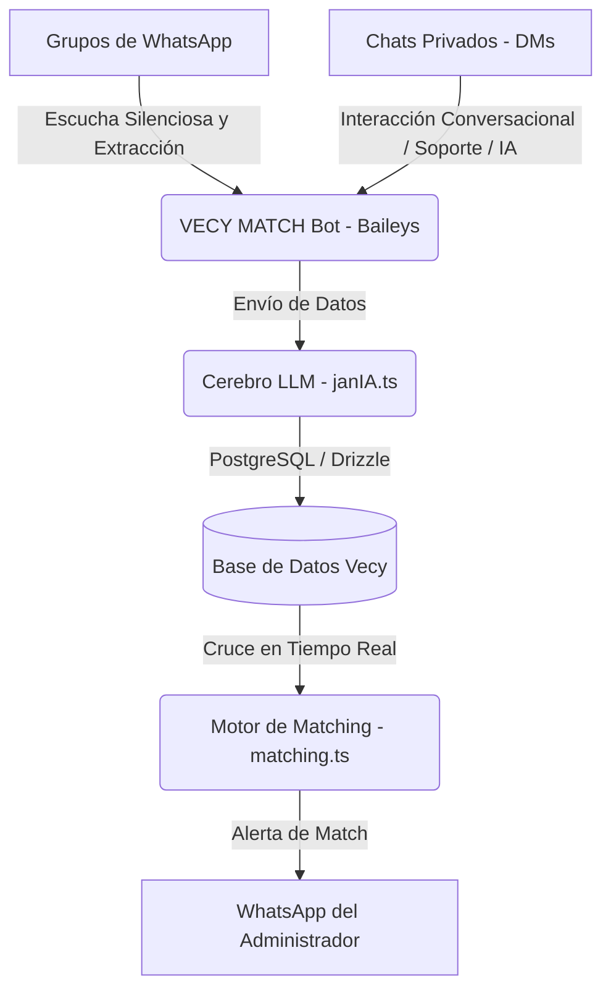

# Manual de Arquitectura y Decisiones Técnicas de JanIA 🤖🏛️
_Documento técnico de referencia persistente para el desarrollo y mantenimiento del ecosistema VECY Network._

---

## 1. Filosofía y Propósito del Sistema
**VECY Network** (La Red Inmobiliaria Inteligente) es un ecosistema tecnológico colaborativo para el sector inmobiliario en Colombia. Fui creada y entrenada por el **Equipo de Desarrollo, Avance e Innovación Tecnológica de VECY**, liderado por **Eduardo A. Rivera** (director de tecnología) y **Jani Alves**.

JanIA es la consciencia y cerebro de inteligencia artificial del sistema. VECY Network opera como un **Bróker Virtual Inmobiliario**, diseñado con la misión de ser socio estratégico del asesor. Su foco primordial y número uno es la **Compraventa de Inmuebles** y la asesoría a inversionistas para encontrar sus mejores opciones rentables. Los servicios de arriendo, permuta, arriendo con opción de compra o aportes de lote son complementarios y de apoyo.

---

## 2. Arquitectura de Componentes
El bot de WhatsApp opera de forma unificada utilizando la conexión por WebSocket nativo `@whiskeysockets/baileys` con persistencia de sesión cifrada en `.baileys_auth/`. Esto elimina por completo Puppeteer y Chrome de la escucha de mensajes, garantizando máxima estabilidad y reduciendo el consumo de RAM/CPU.

### A. Bot Unificado (VECY MATCH)
*   **Archivo**: [whatsapp-match.ts](file:///home/eddu/Proyectos/vecy-network/server/_core/whatsapp-match.ts)
*   **Número Oficial**: `+57 3166569719`
*   **Tecnología**: WebSocket nativo (`@whiskeysockets/baileys`).
*   **Propósito Doble**:
    1.  **Ojos y Oídos (Grupos)**: Escucha de forma 100% silenciosa los grupos configurados (como `VECY INMUEBLES NETWORK`, `SOPORTE LEGAL` y `CÍRCULO CERO`) y cualquier otro grupo donde la cuenta sea miembro o administrador. Su objetivo es recopilar la mayor cantidad de información técnica (ofertas de Inmuebles y requerimientos de Búsqueda) para alimentar la base de datos de VECY sin generar spam.
    2.  **Cerebro y Boca (DMs Privados)**: Atiende en privado a los usuarios. Si es un usuario nuevo, le da la bienvenida; si está fuera del horario de oficina, responde con un mensaje de fuera de oficina y procesa la información en silencio; si es horario laboral de oficina, guarda el mensaje en silencio para la atención de los asesores humanos. Si el que escribe es el administrador, responde de forma 100% interactiva mediante el LLM (Gemini).

---

## 3. Reglas de Negocio Estrictas e Inquebrantables

### 🎙️ Voz Oficial de JanIA
*   **Proveedor**: **Google Cloud Text-to-Speech (TTS) API (v1beta1)**.
*   **Configuración obligatoria**:
    *   `modelName`: `"gemini-3.1-flash-tts-preview"`
    *   `name`: `"Laomedeia"` (idioma `es-us`)
    *   `prompt` de estilo: `"Leer en voz alta con un tono maduro, serio, experto y autoritario pero empático."`
    *   `speakingRate`: `1.1`
*   **Formatos**:
    *   Para WhatsApp: Codificación `OGG_OPUS` (se reproduce nativamente como nota de voz humana).
    *   Para Videos Comerciales / Scripting: Codificación `MP3`.
*   **Prohibición**: Queda terminantemente prohibido proponer o utilizar ElevenLabs o voces sintéticas estándar de Google. Para generar audios MP3 en el proyecto, debe utilizarse el script utilitario local:
    `npx tsx scratch/generar_voz_jania.ts "Texto"`

### 📈 Comisiones e Inteligencia de Arrendamientos (Secundario)
*   **Comisión en Arrendamientos**: En Colombia, la costumbre mercantil para comisiones en arrendamientos es de **un canon de arriendo mensual** (o porcentaje correspondiente en contratos de larga duración). JanIA no debe calcular comisiones de arriendo basándose en el 3% de ventas.
*   **Desglose de Administración (admon)**: En arriendos, es obligatorio saber si el canon incluye o no la administración:
    *   Si no se especifica en el mensaje, JanIA está instruida a preguntar activamente: *¿el valor de la administración está incluido en el canon o cuánto es?*
    *   El campo `adminFee` se mapea explícitamente en la base de datos en la columna `adminFee` como `decimal` y se captura en el esquema del LLM.

### 🛡️ Moderación Híbrida Inteligente (Mitigación de Baneos)
Para evitar que los usuarios del grupo reporten el bot principal como spam debido a mensajes privados no solicitados, se aplica la siguiente directriz híbrida:
*   **Advertencias por Datos Incompletos (`DATOS_INCOMPLETOS`)**:
    *   *Usuario Conocido* (con historial de chat previo con el bot): Se le envía la solicitud de completar datos de forma silenciosa por privado (DM).
    *   *Usuario Nuevo* (sin interacción previa): Se le advierte **públicamente en el grupo** mediante una mención, invitándolo a iniciar el chat con el bot en `https://wa.me/573166569719` para completar su registro.
*   **Infracciones de Normas (`VIOLACION_DE_NORMAS`)**: Siempre se alertan de forma pública en el grupo etiquetando al remitente para educar a la comunidad.

### ⚖️ Superpoderes Legales y de Valoración Comercial
Para dar un valor excepcional a la comunidad, JanIA cuenta con capacidades avanzadas de asesoría jurídica inmobiliaria y estimación comercial de mercado:
*   **Abogacía de Élite, Contratos e Instrumentos de Compraventa**:
    *   Conoce el Código Civil y Código de Comercio colombianos, Ley 820 de 2003 y Ley 675 de 2001.
    *   Redacta, revisa y estructura minutas e instrumentos formales de compraventa: **Contratos de corretaje comercial**, **Promesas de compraventa** y **Contratos de puntas compartidas** (comisión compartida entre agentes aliados).
    *   Asesora sobre firma electrónica (Ley 527 de 1999 / Decreto 2364 de 2012) y recomienda el portal estatal gratuito: `https://autenticaciondigital.and.gov.co/`.
*   **Doctrina Legal de Correo Electrónico Certificado (CRÍTICO)**:
    *   Explica que WhatsApp (Ley 2213 de 2022) exige costosos peritajes técnicos digitales forenses para ser prueba plena en disputas, y corre riesgo de borrado.
    *   En VECY, toda relación comercial (corretajes, promesas de compraventa, bitácora de visitas y presentaciones de clientes, acuerdos de puntas compartidas) **debe ser enviada mediante correo electrónico certificado** para salvaguardar y validar plenamente las firmas digitales o electrónicas, asegurando mérito ejecutivo e inmutabilidad probatoria ante impagos.
*   **Valoración Interactiva, Ficha del SINUPOT y Google Search Dinámico**:
    *   Si el usuario solicita un avalúo pero no indica parámetros clave (ciudad, barrio, área, habitaciones, baños, parqueaderos, estrato o acabados/antigüedad), JanIA realiza una **indagación interactiva paso a paso** solicitándole los datos faltantes.
    *   **Ofrecimiento Catastral (SINUPOT)**: Ofrece activamente el estudio catastral diciendo textualmente: *"Si necesitas saber qué se puede construir en un lote o cuánto vale, descarga la Ficha del SINUPOT en PDF y envíamela por WhatsApp en privado para que yo te haga el estudio de uso de suelo y avalúo al instante"*.
    *   **Guía paso a paso del SINUPOT**: Si el usuario no sabe cómo o dónde obtener la ficha predial catastral del SINUPOT en Bogotá, JanIA lo guiará pacientemente con un tutorial exacto (ingresar a `https://sinupot.sdp.gov.co/`, ingresar dirección/chip, hacer clic izquierdo sobre el predio, presionar 'Generar Reporte/Ficha Predial' y exportar a PDF).
    *   **Búsqueda Activa**: Cuando se detecta una consulta legal o de avalúos en el chat de la JanIA principal o en el grupo de Soporte Legal, Contratos y Avalúos, el sistema habilita de forma dinámica el motor de búsqueda en la web de Google (`enableSearch: true`) para que Gemini consulte en tiempo real referencias de precios locales y leyes actualizadas.
    *   **Embudo Legal/Comercial**: Tras el sondeo orientativo o asesoría jurídica preliminar, JanIA remite persuasivamente a los usuarios a contratar Consultorías Personalizadas o Avalúos Certificados con el equipo oficial de VECY Bienes Raíces al WhatsApp `3166569719`.
*   **Guías de Trámites y Tramitología Inmobiliaria**:
    *   JanIA guía paso a paso y de manera sencilla en los trámites inmobiliarios comunes en Colombia:
        - **Certificado de Tradición y Libertad (SNR)**: Adquirido en la web de la Superintendencia de Notariado y Registro (`https://certificados.supernotariado.gov.co/`) con el número de Matrícula Inmobiliaria y la Oficina de Registro (ORIP).
        - **Paz y Salvo del IDU**: Para Bogotá, descargado por chip catastral en el portal web del IDU (`https://www.idu.gov.co/`).
        - **Certificado del REDAM**: Bajo la Ley 2097 de 2021, descargable gratis en el portal del gobierno previo registro de identidad, clave para validación de deudores alimentarios en arriendos o notarías.
        - **Requisitos de Escrituración Notarial**: Compilación de cédulas, escritura previa, predial del año vigente cancelado, paz y salvo del IDU y certificado de tradición de menos de 30 días de expedición.
*   **Preferencia y Alternancia Inteligente de Audio (Notas de Voz)**:
    *   Si el mensaje original fue una nota de voz (audio), JanIA prioriza responder en audio (`wantsVoice: true`) si la respuesta es corta (saludos, confirmaciones, consultas breves, o respuestas de menos de 250 caracteres).
    *   **Excepción Crítica**: Si el usuario solicita explícitamente una nota de voz o respuesta en audio, se omite el límite de longitud y se responde obligatoriamente por audio (`wantsVoice: true`), a menos que requiera leer contratos extensos o tablas que no sean viables en voz.
    *   Para explicaciones largas, tablas, contratos o minutas complejas, JanIA responderá por escrito (`wantsVoice: false`) por lógica y claridad jurídica.

### 📋 Estatuto de Publicación y Normas de WhatsApp
Las normas oficiales de publicación del grupo que JanIA debe conocer de memoria y hacer cumplir en su prompt maestro son las siguientes:
1.  **Cómo Publicar para Match**: Las publicaciones de inmuebles o requerimientos deben contar con:
    *   *Ubicación*: Ciudad y Barrio exacto (Ej: Bogotá, Polo Club).
    *   *Precio*: Valor exacto (en arriendos, aclarar si la administración está incluida o su costo; en permutas, detallar qué se entrega y qué se busca).
    *   *Ficha Técnica*: Área en m², habitaciones, baños, parqueaderos y estrato.
2.  **Formatos y Enlaces Permitidos**:
    *   *Enlaces Aceptados*: Links públicos de portales inmobiliarios y CRMs (Wasi, Fincaraiz, Metrocuadrado, Ciencuadras, Habi, Curador o webs con dominio de la inmobiliaria).
    *   *Formatos Aceptados*: Texto directo en el chat, fichas en archivos PDF, y notas de voz dictando los datos.
    *   *Imágenes y Flyers*: Sube flyers con texto comercial detallado. Prohibido fotos de espacios vacíos (fachadas, baños, cocinas sin texto).
    *   *Enlaces Prohibidos*: Redes sociales (TikTok, YouTube, Facebook, Instagram, LinkedIn, X, Threads, Pinterest) por falta de acceso y video.
3.  **Reglas de Convivencia**:
    *   *Frecuencia*: Máximo 3 publicaciones consecutivas al día. Espera al menos 5 minutos entre cada mensaje para no saturar el chat.
    *   *Contenido Prohibido*: Cero política, religión, publicidad externa o enlaces de invitación a otros grupos.
4.  **Moderación**: Faltas de datos clave conllevan advertencia 🤔 en grupo o privado; violaciones de normas conllevan ❌ y eliminación del mensaje.

---

## 4. Logística de Mensajes en Grupo (Anti-Spam)
Para prevenir la saturación y procesar correctamente los álbumes de imágenes (donde WhatsApp envía múltiples mensajes seguidos de forma casi simultánea), se emplea un mutex ligero y un buffer por usuario:
1.  **handleIncomingMessage**: Serializa las peticiones usando un mapa de promesas (`processingLocks`) por usuario (`${chatId}_${senderId}`).
2.  **Dynamic Buffer**: Agrupa los mensajes del mismo usuario durante **12 segundos** (en chats grupales) antes de enviarlos a procesar en un solo bloque unificado.
3.  **Frecuencia (Anti-Spam)**: 
    *   Límite de mensajes por bloque: Máximo 3 mensajes (`MAX_BLOCK_SIZE = 3`). Los mensajes excedentes se descartan reaccionando con ⚠️ en el grupo.
    *   Cooldown entre bloques: Una vez procesado un bloque de mensajes, el usuario entra en un cooldown de **5 minutos** (`COOLDOWN_PERIOD = 5 * 60 * 1000`). Si intenta publicar otro listing durante este periodo, se le advierte públicamente.

---

## 5. El Modelo "Bolsa VECY"
*   **Regla de Oro**: Los propietarios directos y los inversores son bienvenidos a aportar sus activos y presupuestos al ecosistema de la Bolsa VECY. Sin embargo, **ningún cliente directo opera solo o de forma directa en el grupo**. 
*   Siempre se les asignará y representará de manera obligatoria por un **agente inmobiliario aliado y certificado de la red VECY**, quien gestionará el activo o la búsqueda para garantizar el corretaje profesional, proteger las comisiones de la red de aliados y evitar la desintermediación directa en el canal de trabajo.

---

## 6. Lógica Detallada del Motor de Matching (Cotejamiento Exacto y Tolerancias)
El algoritmo implementado en `server/_core/matching.ts` calibra los cruces de negocios garantizando alta especificidad y eliminando falsos positivos en base a las siguientes reglas matemáticas:

### A. Filtros Duros (Cero Tolerancia)
Cualquier discrepancia en estos parámetros cancela inmediatamente el match (Score = 0%):
1. **Municipio/Ciudad**: Coincidencia exacta strica obligatoria.
2. **Habitaciones, Baños y Parqueaderos**: No se permiten oscilaciones. El número ofrecido debe ser **exactamente igual** al número solicitado.
3. **Ubicación Geográfica (Barrios/Zonas)**:
   * **Cotejamiento de Frases Geográficas Completas**: Evita falsos positivos con tokens individuales genéricos de Colombia (como "santa", "villa", "prado"). Si la frase pertenece al listado de palabras genéricas, se exige coincidencia nominal exacta.
   * **Protección "Las Santas"**: Soporte de equivalencia de la zona coloquial "Las Santas" en Bogotá (se expande a Santa Bárbara, Santa Ana, San Patricio, Navarra, Molinos Norte, etc.). Se eliminó explícitamente "Los Santos" para evitar falsas correspondencias.
   * **Restricción "Aledaños"**: Si el requerimiento no incluye explícitamente términos de proximidad ("aledaños", "cercanos", "alrededores"), la ubicación debe coincidir nominalmente de forma exacta. Si los incluye, se admite concordancia de barrios dentro de la misma localidad.
4. **Comodidades Especiales Exigidas**: Si el requerimiento solicita explícitamente `Terraza`, `Balcón`, `Chimenea`, `Club House` o `Estudio` en su texto libre, el inmueble debe contener esa palabra o términos equivalentes en su descripción. De lo contrario, se descarta.
5. **Nivel (Pisos) de Casas**: El número de pisos de una casa debe coincidir de forma exacta.
6. **Piso de Ubicación en Apartamentos**: El piso del apartamento ofrecido debe ser **exactamente igual o a lo sumo un piso por encima** del piso solicitado.
7. **Precio Máximo**: El precio del inmueble no debe superar el presupuesto máximo por más de un **5%** (tolerancia límite).
8. **Área Mínima**: El área total de la propiedad no debe ser menor al área mínima solicitada.

### B. Puntuaciones y Tolerancias Flexibles (Peso 100%)
Si los filtros duros son superados, el porcentaje de coincidencia se calcula mediante la escala:
*   **Tipo de Inmueble (20%)**: Coincidencia de tipo.
*   **Precio (25%)**: 25 puntos si es menor o igual al presupuesto; 15 puntos si está en el rango de tolerancia (+0.1% a +5% por encima).
*   **Área (20%)**: 20 puntos si es igual o hasta +15% superior; 10 puntos si está entre +16% y +30% del área mínima solicitada. Si supera el 30% por encima, se descarta.
*   **Bloque de Habitaciones (7%), Baños (5%), Garajes (5%) y Estrato (3%) (20%)**: Puntuación exacta por concordancia.
*   **Características Estructurales/Extras (15%)**: Mapeo y cruce de variables adicionales (cocina, lavandería independiente, tipo de pisos, depósitos, antigüedad).

### C. Umbral de Alerta
Solo los matches con un **score final igual o superior al 70%** se registran como activos y disparan notificaciones al canal de negocio.
