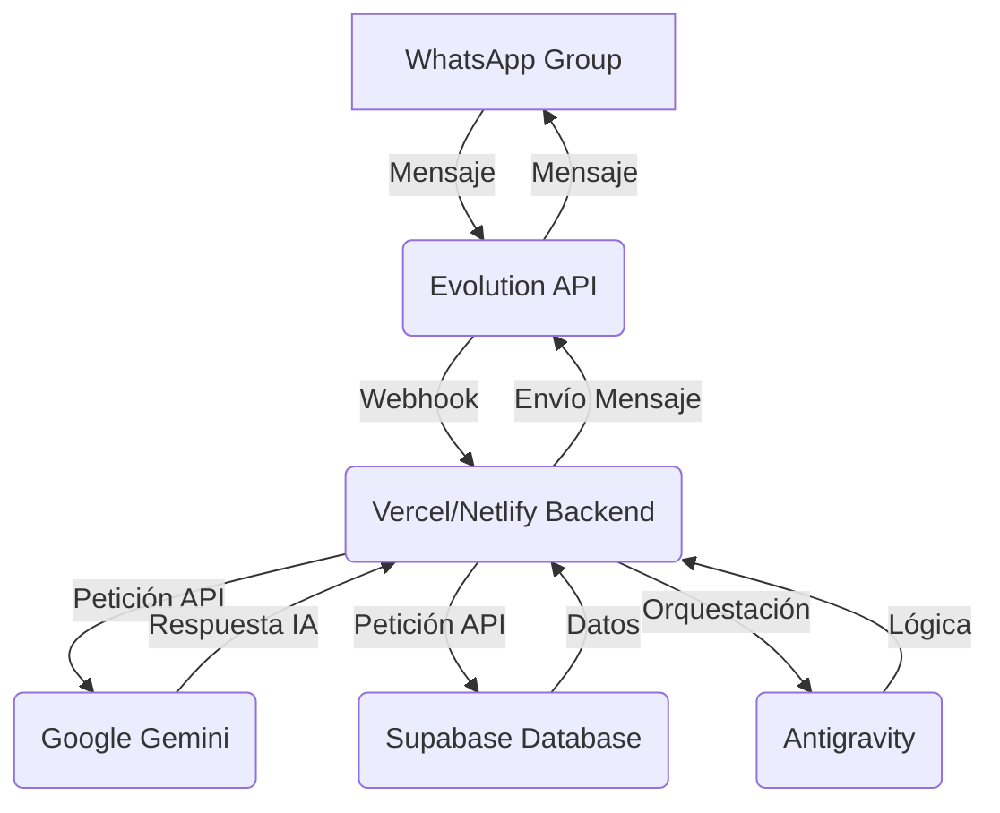

# Guía Técnica Detallada: Conexión de Google Gemini con WhatsApp para Agente Inmobiliario

**Autor:** Manus AI
**Fecha:** 27 de abril de 2026

Esta guía está diseñada específicamente para ti, detallando los pasos para conectar Google Gemini con tu grupo de WhatsApp, aprovechando Evolution API y tu infraestructura de Google Cloud, Supabase, Vercel/Netlify y Antigravity.

## 1. Visión General de la Conexión

La conexión se realizará a través de un *middleware* alojado en Vercel/Netlify, que actuará como intermediario entre Evolution API (tu interfaz con WhatsApp) y Google Gemini (tu motor de IA). Supabase será tu base de datos central y Antigravity coordinará la lógica compleja.



## 2. Configuración de Google Gemini (Google AI Studio)

Dado que tienes acceso gratuito a Gemini a través de Google AI Studio y Google Cloud, esta será tu fuente de inteligencia artificial.

### 2.1. Obtener Credenciales de Gemini API

1.  **Accede a Google AI Studio:** Ve a [https://aistudio.google.com/](https://aistudio.google.com/) e inicia sesión con tu cuenta de Google.
2.  **Crea un Nuevo Proyecto (si es necesario):** Dentro de AI Studio, puedes crear un nuevo proyecto o usar uno existente.
3.  **Genera una Clave API:** En la sección de "API key" o "Credenciales", genera una nueva clave API. **Guarda esta clave en un lugar seguro**, ya que la necesitarás para tu backend en Vercel/Netlify.
4.  **Habilitar APIs en Google Cloud:** Asegúrate de que la API de Gemini (o la API de Vertex AI si usas modelos avanzados) esté habilitada en tu proyecto de Google Cloud. Puedes hacerlo desde la consola de Google Cloud, navegando a "APIs y Servicios" -> "Biblioteca".

### 2.2. Configuración de Prompts para Gemini

En Google AI Studio, puedes pre-entrenar a Gemini con *prompts* específicos para tus tareas:

*   **Prompt para Clasificación y Extracción:** Entrena a Gemini para identificar si un mensaje es un "INMUEBLE" o un "REQUERIMIENTO" y extraer sus campos clave (tipo, zona, precio, etc.).
    *   **Ejemplo de Prompt:**
        ```
        Eres un asistente inmobiliario experto. Analiza el siguiente texto y clasifícalo como 'INMUEBLE' o 'REQUERIMIENTO'. Luego, extrae los siguientes campos en formato JSON: tipo, zona, precio, habitaciones, baños, área, contacto, url_externa. Si un campo no está presente, usa 'null'.

        Texto: "Vendo apto en cedritos, 3 alcobas, sala comedor, cocina integral, 2 baños, garaje. Piso 4. Info al 310..."
        Respuesta:
        {
          "clasificacion": "INMUEBLE",
          "tipo": "Apartamento",
          "zona": "Cedritos",
          "precio": null,
          "habitaciones": 3,
          "banos": 2,
          "area": null,
          "contacto": "310...",
          "url_externa": null
        }
        ```
*   **Prompt para Respuestas Guiadas:** Entrena a Gemini para generar las preguntas de seguimiento y las opciones de respuesta rápida, basándose en los campos faltantes.
*   **Prompt para Resumen de Enlaces:** Entrena a Gemini para resumir el contenido de una URL externa (CRM, catálogo) en un formato conciso para el mensaje de *match*.

## 3. Configuración de Evolution API

Evolution API será tu puerta de enlace a WhatsApp. Necesitarás un servidor donde alojarlo o usar un servicio gestionado.

### 3.1. Despliegue de Evolution API

1.  **Servidor:** Puedes desplegar Evolution API en un servidor virtual en Google Cloud (Compute Engine) o en cualquier otro proveedor. Es una aplicación Node.js/Docker.
2.  **Conexión con WhatsApp:** Una vez desplegado, accederás a la interfaz de Evolution API (usualmente vía web) para escanear un código QR con el WhatsApp que deseas usar para el agente. **Este WhatsApp puede ser un número personal o de WhatsApp Business.**
3.  **Configuración de Webhooks:** En la configuración de Evolution API, deberás establecer un *webhook URL* que apunte a tu backend en Vercel/Netlify. Este webhook enviará todos los mensajes entrantes del grupo a tu backend para su procesamiento.
    *   **URL del Webhook:** `https://tu-dominio-vercel.vercel.app/api/whatsapp-webhook` (o similar).
    *   **Eventos a Escuchar:** Configura el webhook para que envíe eventos de `message` (mensajes de texto, imágenes, videos, enlaces) y `group_join` (cuando un nuevo miembro se une al grupo).

## 4. Desarrollo del Backend (Vercel/Netlify Edge Functions)

Este será el código que procesa los mensajes y orquesta la interacción.

### 4.1. Creación del Proyecto

1.  **Proyecto en Vercel/Netlify:** Crea un nuevo proyecto y conecta tu repositorio de Git (GitHub, GitLab, Bitbucket).
2.  **Variables de Entorno:** Configura las siguientes variables de entorno en tu proyecto de Vercel/Netlify:
    *   `GEMINI_API_KEY`: Tu clave API de Google Gemini.
    *   `EVOLUTION_API_URL`: La URL base de tu instancia de Evolution API (ej. `http://tu-ip-evolution-api:8080`).
    *   `EVOLUTION_API_TOKEN`: El token de autenticación de tu Evolution API.
    *   `SUPABASE_URL`: La URL de tu proyecto Supabase.
    *   `SUPABASE_ANON_KEY`: La clave `anon` de tu proyecto Supabase.

### 4.2. Lógica del Webhook (`/api/whatsapp-webhook`)

Este es un pseudocódigo de cómo funcionaría tu función *serverless*:

```javascript
// Ejemplo de Edge Function en Vercel (Node.js)
import { GoogleGenerativeAI } from "@google/generative-ai";
import { createClient } from '@supabase/supabase-js';
import axios from 'axios';

const genAI = new GoogleGenerativeAI(process.env.GEMINI_API_KEY);
const model = genAI.getGenerativeModel({ model: "gemini-pro" }); // O gemini-pro-vision para imágenes
const supabase = createClient(process.env.SUPABASE_URL, process.env.SUPABASE_ANON_KEY);

export default async function handler(req, res) {
  if (req.method !== 'POST') {
    return res.status(405).send('Method Not Allowed');
  }

  const event = req.body; // Datos del webhook de Evolution API

  // Filtrar para asegurar que solo procesamos mensajes del grupo específico
  if (event.data.key.remoteJid !== 'ID_DE_TU_GRUPO_WHATSAPP@g.us') {
    return res.status(200).send('Ignorando mensaje de otro chat.');
  }

  const messageText = event.data.message.conversation || event.data.message.extendedTextMessage.text;
  const senderJid = event.data.key.participant || event.data.key.remoteJid; // Quién envió el mensaje

  // 1. Procesamiento de Mensajes (Clasificación, Extracción, Estructuración)
  try {
    const prompt = `Eres un asistente inmobiliario experto. Analiza el siguiente texto y clasifícalo como 'INMUEBLE' o 'REQUERIMIENTO'. Luego, extrae los siguientes campos en formato JSON: tipo, zona, precio, habitaciones, baños, área, contacto, url_externa. Si un campo no está presente, usa 'null'. Si es una consulta general, clasifícalo como 'GENERAL'.\n\nTexto: "${messageText}"`;
    const result = await model.generateContent(prompt);
    const response = await result.response;
    const jsonResponse = JSON.parse(response.text().replace(/```json|```/g, ''));

    if (jsonResponse.clasificacion === 'INMUEBLE') {
      // Lógica para procesar inmueble (guardar en Supabase, iniciar flujo guiado)
      await supabase.from('inmuebles').insert({ ...jsonResponse, raw_text_original: messageText, contacto: senderJid });
      // Generar respuesta guiada con Gemini para pedir datos faltantes
      const guidedResponse = await model.generateContent(`Genera una respuesta amigable para el usuario ${senderJid} sobre el inmueble ${JSON.stringify(jsonResponse)}, pidiendo los datos faltantes de forma interactiva. Ofrece opciones de respuesta rápida.`);
      await sendWhatsAppMessage(senderJid, guidedResponse.response.text());

    } else if (jsonResponse.clasificacion === 'REQUERIMIENTO') {
      // Lógica para procesar requerimiento (guardar en Supabase, iniciar flujo guiado)
      await supabase.from('requerimientos').insert({ ...jsonResponse, raw_text_original: messageText, contacto: senderJid });
      // Generar respuesta guiada con Gemini para pedir datos faltantes
      const guidedResponse = await model.generateContent(`Genera una respuesta amigable para el usuario ${senderJid} sobre el requerimiento ${JSON.stringify(jsonResponse)}, pidiendo los datos faltantes de forma interactiva. Ofrece opciones de respuesta rápida.`);
      await sendWhatsAppMessage(senderJid, guidedResponse.response.text());

    } else if (jsonResponse.clasificacion === 'GENERAL') {
      // Lógica para consultas generales (bienvenida, ayuda, etc.)
      const generalResponse = await model.generateContent(`Responde a la consulta general: "${messageText}" del usuario ${senderJid}. Ofrece ayuda sobre cómo publicar inmuebles o requerimientos.`);
      await sendWhatsAppMessage(senderJid, generalResponse.response.text());
    }

  } catch (error) {
    console.error('Error procesando mensaje:', error);
    await sendWhatsAppMessage(senderJid, 'Lo siento, hubo un error al procesar tu mensaje. Por favor, inténtalo de nuevo.');
  }

  return res.status(200).send('Mensaje procesado');
}

// Función para enviar mensajes vía Evolution API
async function sendWhatsAppMessage(recipientJid, message) {
  const url = `${process.env.EVOLUTION_API_URL}/message/sendText/${process.env.EVOLUTION_API_TOKEN}`;
  await axios.post(url, {
    number: recipientJid, // Puede ser el ID del grupo o el número del usuario
    textMessage: { text: message }
  });
}
```

### 4.3. Manejo de Enlaces Externos (Web Scraping)

Si Gemini detecta una `url_externa` en el mensaje, tu backend deberá:

1.  **Descargar Contenido:** Usar una librería (ej. `axios` para HTTP, `cheerio` para parsing HTML) para descargar el contenido de la URL.
2.  **Enviar a Gemini para Resumen:** Enviar el contenido relevante a Gemini con un prompt como: *"Resume este contenido web sobre un inmueble, extrayendo tipo, zona, precio, habitaciones, baños, área y características clave en JSON. URL: [URL_ORIGINAL]"*.
3.  **Almacenar y Notificar:** Guardar la información estructurada en Supabase y usarla para el *matching* y las notificaciones, incluyendo el enlace original.

## 5. Configuración de Supabase

Supabase será tu base de datos PostgreSQL con una API REST automática y funciones de base de datos.

### 5.1. Creación de Tablas

Crea las tablas `inmuebles` y `requerimientos` como se detalló en la propuesta principal, asegurándote de incluir campos para `url_externa` y `raw_text_original`.

### 5.2. Implementación de `Postgres Functions` para Matching

Crea las funciones SQL para el *matching* directamente en Supabase. Estas funciones serán invocadas desde tu backend de Vercel/Netlify para encontrar coincidencias de forma eficiente.

## 6. Integración con Antigravity

Antigravity puede ser utilizado para la lógica de razonamiento de alto nivel, especialmente para la gestión de estados de conversación complejos y la generación dinámica de *prompts* para Gemini. Por ejemplo, Antigravity podría decidir cuándo un usuario ha completado un flujo de publicación o cuándo es el momento de ofrecer un *match*.

## 7. Privacidad y Control del Agente en WhatsApp

### 7.1. Acceso Exclusivo al Grupo

Evolution API te permite controlar qué chats procesa tu webhook. En el código de tu backend (sección 4.2), hemos incluido una línea clave:

```javascript
  if (event.data.key.remoteJid !== 'ID_DE_TU_GRUPO_WHATSAPP@g.us') {
    return res.status(200).send('Ignorando mensaje de otro chat.');
  }
```

**`ID_DE_TU_GRUPO_WHATSAPP@g.us`** es el identificador único de tu grupo. Deberás obtenerlo (Evolution API suele proporcionarlo en los datos del webhook o puedes inspeccionar los logs). Al incluir esta verificación, tu agente **solo procesará mensajes de ese grupo específico**, ignorando cualquier otro chat individual o grupal en el WhatsApp conectado.

### 7.2. Hardware y Número de Teléfono

*   **¿Teléfono Físico?** No es estrictamente necesario. Evolution API funciona emulando una sesión de WhatsApp Web. Puedes escanear el código QR desde cualquier teléfono (incluso uno personal) y luego ese teléfono ya no necesita estar conectado a internet para que Evolution API funcione (aunque es recomendable mantenerlo activo para evitar desconexiones).
*   **¿SIM Nueva / Número Aparte?** **Altamente recomendado.** Para evitar cualquier intrusión en tu vida personal y mantener la profesionalidad del agente, es ideal usar un número de teléfono dedicado para este propósito. Puede ser una SIM nueva o un número virtual si tu proveedor lo permite.
*   **¿Con o Sin Plan de Datos/Minutos?** El número de WhatsApp conectado a Evolution API **solo necesita estar activo para el escaneo inicial del QR**. Una vez conectado, Evolution API gestiona la sesión. Sin embargo, para mayor estabilidad y para recibir notificaciones de WhatsApp (que no sean procesadas por el agente), un plan básico de datos y minutos en el teléfono físico asociado al número es una buena práctica, aunque no estrictamente indispensable para el funcionamiento del agente una vez conectado.

### 7.3. Consideraciones de Seguridad

*   **Claves API:** Nunca expongas tus claves API directamente en el código del frontend o en repositorios públicos. Usa variables de entorno seguras en Vercel/Netlify.
*   **Evolution API:** Asegura tu instancia de Evolution API con un firewall y contraseñas robustas si la auto-alojas.
*   **Supabase:** Configura las políticas de seguridad (Row Level Security) en Supabase para controlar estrictamente quién puede leer y escribir en tus tablas.

Con esta guía, tienes los pasos claros para construir tu Agente IA Inmobiliario con Google Gemini, optimizando tus recursos y manteniendo el control total sobre la privacidad y el alcance de tu agente.
