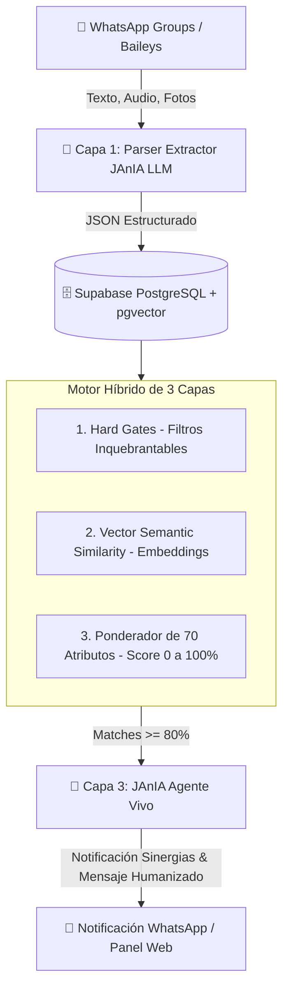

# 🚀 JANIA SUPREMACY MATCH ENGINE (Arquitectura de Coincidencia Inmobiliaria de Nivel Big-Tech)

---

## 💡 ¿Por qué fallaron los enfoques anteriores?

### 1. El error de confiar 100% en un solo Prompt de LLM (Google AI Studio)
Los Modelos de Lenguaje (LLMs) están diseñados para la **similitud semántica**, no para las **desigualdades matemáticas estrictas**. 
- Cuando un LLM lee que el presupuesto máximo es de **11 Millones** y ve una propiedad de **19 Millones**, ve que ambas hablan de "arriendo de apartamentos de alto valor en Bogotá" y le asigna una alta probabilidad de coincidencia. El LLM es "demasiado tolerante" porque calcula atención de palabras, no restricciones duras.

### 2. El error del Código Tradicional Rígido (`if / else`)
Los algoritmos tradicionales de software fracasan porque el lenguaje humano en los grupos de WhatsApp de finca raíz es desordenado, lleno de jerga colombiana (*"500 mll"*, *"pelo a pelo"*, *"baño y medio"*, *"servidumbre"*), notas de voz y formatos variados. Si un dato falta, el código tradicional colapsa o retorna cero.

---

## 🏆 LA SOLUCIÓN: Arquitectura Híbrida de 3 Capas (El Motor de JAnIA)

Para lograr una **Supremacía Inmobiliaria**, JAnIA no debe ser solo un prompt ni solo un script de Node.js; debe ser una **Red Neuronal Híbrida de 3 Capas**:



---

## 📐 Algoritmo de Ponderación Matemática (Score 0% a 100%)

$$Score_{Total} = (Gate_{Hard}) \times \left( W_{base} \cdot S_{base} + W_{vector} \cdot S_{vector} + W_{checklist} \cdot S_{checklist} \right)$$

Donde $Gate_{Hard} \in \{0, 1\}$ cancela inmediatamente la coincidencia si se viola una regla inquebrantable.

### 1. Capa 1: Filtros Inquebrantables (`Hard Gates`)
Si cualquiera de estas 4 condiciones falla, el Match es **0% de inmediato**:

1. **Techo de Presupuesto ($P_{\text{inmueble}} \le P_{\text{max\_req}}$)**:
   - Si el presupuesto del requerimiento es un **máximo** (ej. $11M), cualquier inmueble de $11.000.001 M en adelante queda cancelado.
2. **Incompatibilidad Total de Negocio**:
   - Requerimiento que exige **100% Efectivo** no hace match con publicación que exige **100% Permuta**.
3. **Ubicación Fuera de Rango Geográfico**:
   - Distancia lineal / geográfica mayor al radio solicitado.
4. **Tipo de Inmueble Incompatible**:
   - Cliente que busca exclusivamente **Bodega** no recibe **Apartamento**.

---

### 2. Capa 2: Ponderación de Atributos y Vectores (`pgvector`)

Una vez superados los `Hard Gates`, JAnIA evalúa los 70 atributos del formulario `/form-propiedades`:

| Atributo | Peso ($W_i$) | Regla de Tolerancia / Ponderación |
| :--- | :---: | :--- |
| **Habitaciones** | 20% | `req <= inmueble` $\rightarrow$ 100%. Si `inmueble = req - 1` $\rightarrow$ 50% (Aproximado). |
| **Baños** | 15% | 1.5 baños (social) se satisface al 100% con 2+ baños completos. |
| **Garajes** | 15% | Si el requerimiento pide "Independiente" y el inmueble es "En línea con servidumbre", penaliza un 40% la nota del garaje. |
| **Permutas %** | 15% | Selector deslizable (10% a 90%). Compara la coincidencia de los bienes a recibir (carros, menor valor). |
| **25 Amenidades Internas** | 15% | Jaccard Similarity entre las amenidades requeridas vs presentes. |
| **45 Amenidades Externas** | 10% | Jaccard Similarity (Club House, Gimnasio, Vigilancia 24/7, etc.). |
| **Vector Semántico (`pgvector`)** | 10% | Similitud de coseno entre el embedding del requerimiento (estilo de vida: "tranquilo", "iluminado") y la descripción del inmueble. |

---

### 3. Capa 3: JAnIA "Viva" (Agente de Inferencia y Notificación)

JAnIA no solo muestra una tabla en la web; **habla y actúa como un broker senior experto**:

```typescript
// Estructura de Salida de JAnIA al detectar un Match >= 80%
export interface JaniaMatchResult {
  matchPercentage: number; // Ej: 93%
  status: "EXACTO" | "ALTO_POTENCIAL" | "PARCIAL";
  summary: string;
  reasons: {
    coincidencias: string[];
    aproximados: string[];
    faltantes: string[];
  };
  humanizedWhatsappMessage: string;
}
```

#### Ejemplo de Mensaje Generado por JAnIA:
> *"¡Hola Jani y Eduardo! 🚀 Encontré un **MATCH del 92%** entre el requerimiento de Mauricio (Rosales, $11M max) y la publicación de Sandra.*
> 
> - ✅ **Coinciden al 100%**: Canon ($10.5M con admón), 3 habitaciones, 2 garajes independientes y Club House.
> - ⚠️ **Dato Aproximado**: El requerimiento pedía cocina americana y el inmueble tiene cocina cerrada remodelada.
> - ❓ **Dato Faltante**: No especifican si aceptan mascota.
> 
> *¿Quieren que les prepare la ficha técnica de sinergia para enviársela al agente por WhatsApp?"*

---

## 🛠️ Implementación en Código para Supabase & Baileys

### SQL: Función de Match en Supabase (PostgreSQL)

```sql
CREATE OR REPLACE FUNCTION match_inmuebles_jania(
  p_req_id UUID,
  p_min_score FLOAT DEFAULT 0.80
)
RETURNS TABLE (
  inmueble_id UUID,
  score FLOAT,
  es_aproximado BOOLEAN
) AS $$
BEGIN
  RETURN QUERY
  SELECT 
    i.id AS inmueble_id,
    (
      -- Hard Gate Presupuesto
      CASE WHEN i.precio > r.precio_max THEN 0 ELSE 1 END *
      -- Hard Gate Negocio
      CASE WHEN i.tipo_negocio != r.tipo_negocio AND r.tipo_negocio != 'Cualquiera' THEN 0 ELSE 1 END *
      -- Score Ponderado
      (
        (CASE WHEN i.habitaciones >= r.habitaciones_min THEN 0.25 ELSE 0.12 END) +
        (CASE WHEN i.banos >= r.banos_min THEN 0.20 ELSE 0.10 END) +
        (CASE WHEN i.garajes >= r.garajes_min THEN 0.15 ELSE 0.05 END) +
        (0.20 * (1 - (1 <=> (i.embedding <-> r.embedding)))) +
        (0.20 * jaccard_similarity(i.amenidades_internas, r.amenidades_internas))
      )
    ) AS score,
    CASE WHEN i.precio > (r.precio_max * 0.95) THEN TRUE ELSE FALSE END AS es_aproximado
  FROM inmuebles i
  CROSS JOIN requerimientos r
  WHERE r.id = p_req_id
    AND (i.precio <= r.precio_max) -- Hard Gate estricto
  HAVING score >= p_min_score
  ORDER BY score DESC;
END;
$$ LANGUAGE plpgsql;
```
