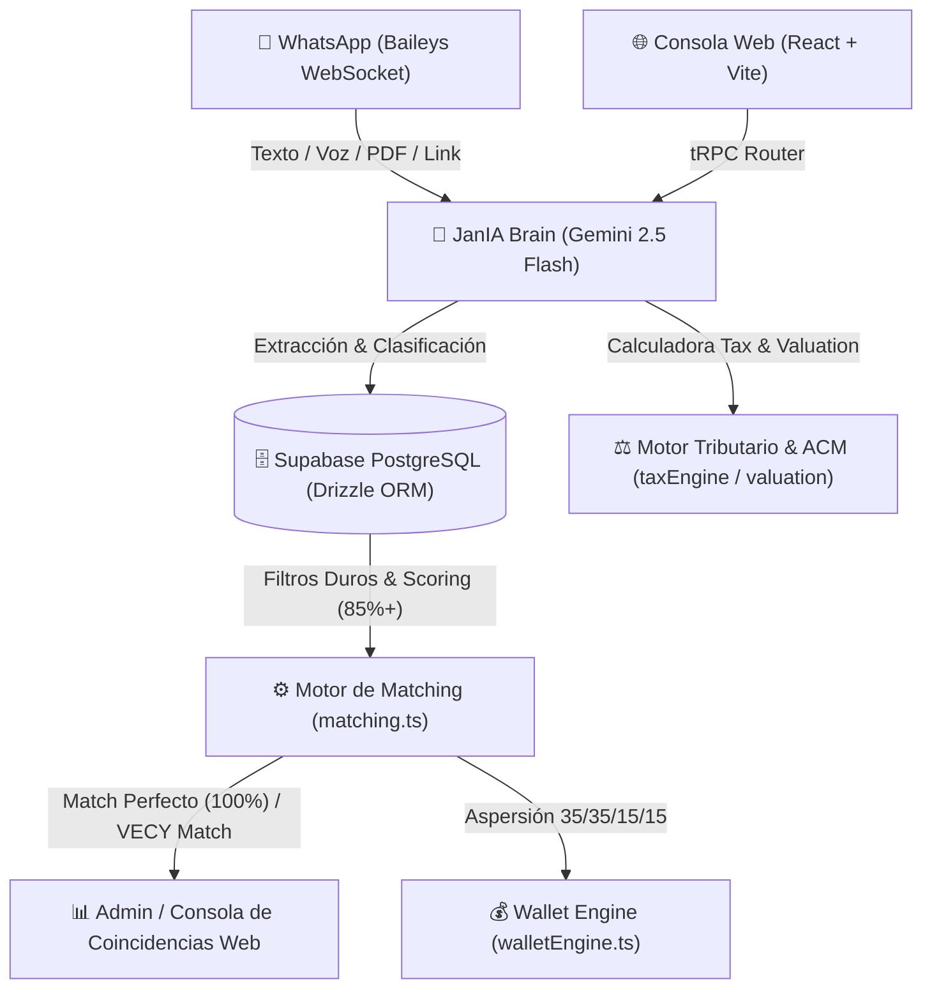
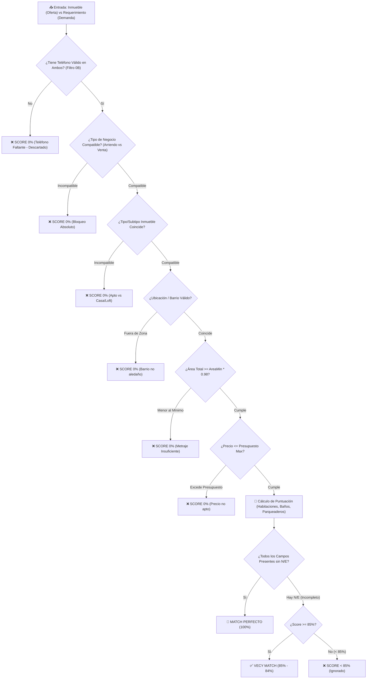
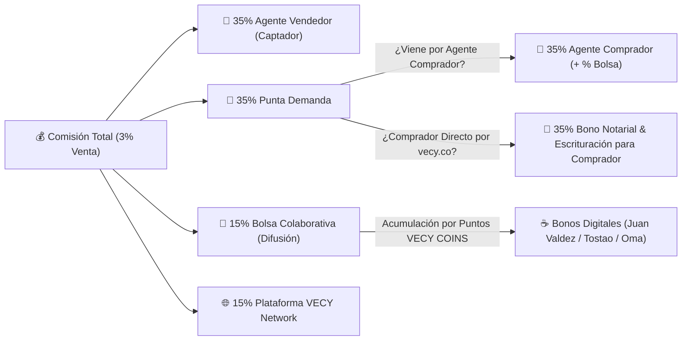
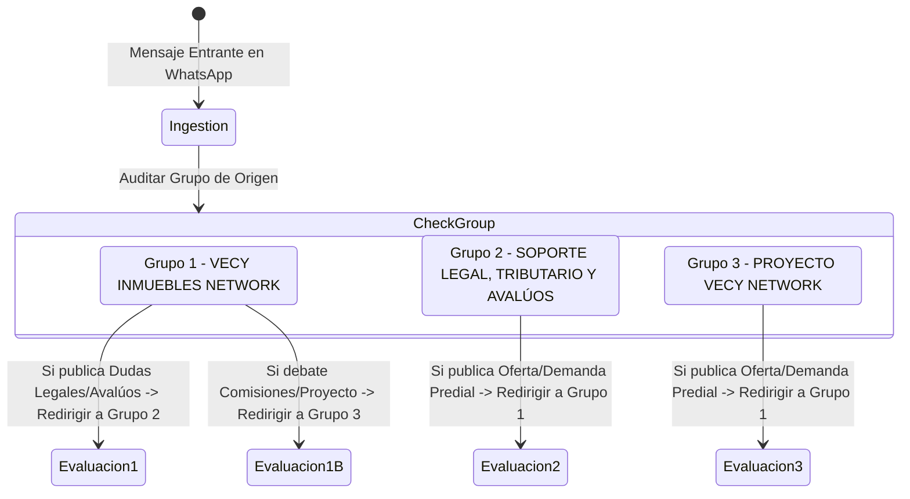

# Dossier Estratégico y de Arquitectura Técnica: Ecosistema VECY Network 🚀🏠
_Manual maestro de visión de producto, lógica de negocio, arquitectura de software y plan de evolución de la Red Colaborativa._

> [!NOTE]
> **Nota para Auditoría AI-to-AI**: Este dossier técnico describe los adaptadores e infraestructura del sistema. Está diseñado para alinearse y soportar el guion de startup y el plan comercial detallado en [vecy_network_business_plan.md](file:///home/eddu/.gemini/antigravity-ide/brain/0bf8270e-e7ac-4c7a-968d-681c91ac7aea/vecy_network_business_plan.md).

---

## 📄 ÍNDICE GENERAL

1.  **[El Origen de VECY Network y la Filosofía del Cambio](#1-el-origen-de-vecy-network-y-la-filosofía-del-cambio)**
    *   *Quiénes somos*
    *   *Qué queremos o qué buscamos*
    *   *El porqué y el para qué*
    *   *Misión, visión y el vacío de los "Dinosaurios Inmobiliarios"*
2.  **[Definición de Categoría: Qué es y qué debe ser VECY](#2-definición-de-categoría-qué-es-y-qué-debe-ser-vecy)**
    *   *Ecosistema Inmobiliario de Colaboración Transaccional*
3.  **[El Modelo "Red de Mercadeo Inmobiliario" (Bolsa Colaborativa)](#3-el-modelo-red-de-mercadeo-inmobiliario-bolsa-colaborativa)**
    *   *El Catálogo Doble: Tienda de Inmuebles vs Tienda de Requerimientos*
    *   *Interacciones: "Agendar Visita" (Cliente) vs "Participar" (Agente)*
4.  **[Esquema de Comisiones y Reparto de Regalías (Total 3% / 1 Canon)](#4-esquema-de-comisiones-y-reparto-de-regalías-total-3--1-canon)**
    *   *Desglose del 35% / 35% / 15% / 15%*
    *   *Premio/Descuento para el Comprador Directo*
5.  **[Tecnología de Rastreo de Enlaces y Gamificación (Engagement Tracker)](#5-tecnología-de-rastreo-de-enlaces-y-gamificación-engagement-tracker)**
    *   *Ficha Técnica Web (Dossier Web) con SEO Potenciado*
    *   *Métrica de Interacción General (Likes, Clicks, Shares)*
6.  **[Análisis de Flujos de Registro y Onboarding (Para Auditoría AI)](#6-análisis-de-flujos-de-registro-y-onboarding-para-auditoría-ai)**
7.  **[El Rol de JanIA y el Canal de WhatsApp](#7-el-rol-de-jania-y-el-canal-de-whatsapp)**
    *   *Extracción pasiva sin discriminación y políticas anti-ban*
8.  **[Mapa Interactivo de Colombia y Coincidencias al 100%](#8-mapa-interactivo-de-colombia-y-coincidencias-al-100%)**


---

## 🎨 DIAGRAMAS VISUALES DE ARQUITECTURA Y ÁRBOLES DE DECISIÓN DE VECY NETWORK

### 📊 Diagrama 1: Arquitectura General del Ecosistema VECY Network


---

### 🌲 Diagrama 2: Árbol de Decisión del Motor de Matching (Filtros Duros & Threshold 85%-100%)


---

### 💰 Diagrama 3: Esquema de Aspersión Financiera (Wallet Engine 35% / 35% / 15% / 15%)


---

### 🔀 Diagrama 4: Diagrama de Enrutamiento y Moderación Inter-Grupos


---

## 1. EL ORIGEN DE VECY NETWORK Y LA FILOSOFÍA DEL CAMBIO

### ¿Quiénes somos?
**VECY Network** es una red transaccional y colaborativa de corretaje inmobiliario para Colombia. Es una iniciativa tecnológica nacida de la experiencia empírica y estratégica del equipo de VECY, liderado por **Eduardo A. Rivera** (Director de Tecnología y Creador Conceptual) y **Jani Alves** (Directora de Operaciones y Relaciones Humanas).

### ¿Qué queremos o qué buscamos?
Queremos revolucionar el corretaje inmobiliario tradicional creando una economía de colaboración abierta y descentralizada en Colombia. Buscamos eliminar la intermediación ineficiente, erradicar la desintermediación maliciosa, democratizar el marketing de propiedades y garantizar que el esfuerzo de difusión masiva de todos los corredores de la red sea remunerado de manera justa y equitativa mediante regalías Fintech basadas en mérito y engagement.

### El porqué y el para qué de la idea
*   **El porqué (El Estancamiento del Sector)**: Tradicionalmente, los portales inmobiliarios cobran altas sumas de dinero a los corredores simplemente por publicar listados de inmuebles (oferta), pero aíslan las demandas (requerimientos de compra) en libretas personales o chats privados. Los asesores pierden semanas buscando inmuebles compatibles en cadenas infinitas de grupos de WhatsApp, lo que provoca lentitud y que los clientes finales los salten (desintermediación).
*   **El para qué (La Disrupción)**: VECY nace para automatizar la conexión entre la oferta y la demanda, centralizando todo en una **Bolsa Inmobiliaria Colaborativa**. Mediante inteligencia artificial, el sistema asume la tarea de cruzar al instante las intenciones de los agentes, permitiéndoles colaborar de manera segura, compartir comisiones transparentemente y cerrar negocios en una fracción del tiempo tradicional.

### Misión y Visión
*   **Misión**: Empoderar a los agentes inmobiliarios independientes de Colombia mediante tecnología de inteligencia artificial y procesos digitales automatizados (cero papel, firmas electrónicas y transacciones seguras), eliminando la fricción de búsqueda y protegiendo su comisión.
*   **Visión**: Convertirse en la Bolsa Colaborativa de Bienes Raíces líder en Latinoamérica, donde cada propiedad y cliente comprador de la red se conecten de forma inmediata gracias al análisis predictivo e inferencia de la IA.

### Los "Dinosaurios Inmobiliarios"
Los grandes portales tradicionales de Colombia (Metrocuadrado, Fincaraíz, Ciencuadras) se han quedado obsoletos por dos razones fundamentales:
1.  **Cero Inteligencia Artificial**: Operan como directorios pasivos de anuncios clasificados. No analizan la elasticidad de los precios, la viabilidad de la zona, ni simulan pre-negociaciones.
2.  **Inexistencia del Catálogo de Requerimientos**: Ninguno de estos portales ofrece una "tienda" o buscador público para los requerimientos (qué busca comprar la gente). VECY es el primer ecosistema que da el mismo valor e interfaz a la demanda (requerimientos) que a la oferta (inmuebles), facilitando un flujo comercial bidireccional.

---

## 2. DEFINICIÓN DE CATEGORÍA: QUÉ ES Y QUÉ DEBE SER VECY

### Categorización de Producto
Para que cualquier IA comprenda el ecosistema de VECY, no debe catalogarse bajo un solo término clásico. **VECY es un Ecosistema Inmobiliario de Colaboración Transaccional (B2B/B2C)**.

Une e integra los siguientes pilares:
1.  **Portal de Matches**: Una plataforma web pública con mapas interactivos y listados cruzados.
2.  **Bolsa Colaborativa / Red de Mercadeo Inmobiliario**: Un modelo de distribución y promoción masiva de inmuebles entre agentes aliados que comparten comisiones en red.
3.  **Herramienta Inmobiliaria con IA (WhatsApp Concierge)**: JanIA actúa como la captadora silenciosa en WhatsApp, digitalizando y normalizando la informalidad de los grupos comerciales.
4.  **Fintech Inmobiliaria (El "Modelo Starbucks")**: VECY evoluciona de pasarela de pagos a una Fintech completa. Adopta el exitoso modelo financiero de Starbucks (donde los puntos y saldos de la app funcionan como una wallet y moneda digital del ecosistema). Los agentes acumulan puntos por compartir, interactuar y cerrar negocios.
5.  **Programa de Fidelización "VECY COINS" (Alianzas con Juan Valdez, Tostao y Oma)**: Modelo de redención por Bonos Digitales de canje instantáneo para disfrutar en las principales cadenas de café de Colombia (Juan Valdez, Tostao' y Café Oma) permitiendo a los asesores pagar sus consumos en reuniones de cierre directamente con sus puntos acumulados.
6.  **Portafolio de Servicios Financieros**: VECY aprovecha su músculo Fintech para ofrecer financiamiento de vivienda: créditos hipotecarios, leasing habitacional, créditos de libre inversión con garantía hipotecaria y pactos de retroventa para otorgar liquidez inmediata a propietarios. Es decir: *un negocio inmobiliario y financiero completo detrás de una taza de café*.

---

## 3. EL MODELO "RED DE MERCADEO INMOBILIARIO" (BOLSA COLABORATIVA)

La gran innovación del modelo VECY es la fusión del corretaje tradicional con las mecánicas de una **Red de Mercadeo (Marketing Multinivel/Afiliados)** aplicadas a propiedades físicas:

### 3.1 El Catálogo Doble (Tienda Web)
El sitio web (`vecy.co`) expone dos interfaces públicas:
*   **Tienda de Inmuebles**: Catálogo donde clientes y agentes ven propiedades en venta y arriendo con excelente material audiovisual y especificaciones técnicas.
*   **Tienda de Requerimientos**: Catálogo público donde los vendedores y agentes de la red pueden ver qué presupuestos y características están buscando activamente los compradores en cada zona, permitiendo ofrecer propiedades directamente al cliente que ya tiene la plata en mano.

### 3.2 Interacciones y Botones de Acción
Dentro del Catálogo, cada ficha de inmueble cuenta con dos opciones según la naturaleza del visitante:

#### A. Botón "Agendar Visita" (Para Clientes Directos)
*   *Destinatario*: Compradores finales, inversionistas o arrendatarios.
*   *Función*: Abre un flujo directo para seleccionar fecha y hora de visita, el cual es asignado al corredor que captó el inmueble para su acompañamiento.

#### B. Botón "Participar en Promoción" (Para Agentes de la Red)
*   *Destinatario*: Asesores independientes que pertenecen a la Red Colaborativa.
*   *Función*: Permite al agente sumarse a la promoción del inmueble. El sistema le genera un enlace personalizado y rastreable (**Dossier Web** o **Ficha Técnica Web** de Marca Blanca) con las fotos y videos de la propiedad. El agente comparte este link en sus redes sociales, blogs o WhatsApp. Si se concreta una venta gracias a la difusión de la red, los participantes reciben regalías económicas.

---

## 4. ESQUEMA DE COMISIONES Y REPARTO DE REGALÍAS

Para incentivar el "voz a voz humano" y la compartición masiva, VECY establece una distribución de comisiones transparente y altamente motivadora sobre el total de la comisión cobrada (habitualmente el **3% del valor final de venta** o **1 canon de arrendamiento mensual**):

```
       [ Comisión Total Cobrada (3% de Venta o 1 Canon de Arriendo) ]
                                      │
          ┌───────────────────────────┼───────────────────────────┐
          ▼                           ▼                           ▼
[ Captador del Inmueble ]   [ Colocador del Cliente ]   [ Red Colaborativa ]  [ VECY Network ]
        (35%)                       (35%)               (15% por Puntos)           (15%)
```

### 4.1 Desglose del Reparto
1.  **35% - Punta de Captación**: Para el corredor que consiguió el inmueble y lo subió al catálogo de VECY.
2.  **35% - Punta de Colocación**: Para el corredor de la red que consiguió al comprador final y coordinó el cierre del negocio.
3.  **15% - Bolsa de la Red Colaborativa**: Un fondo que se limita a un máximo matemático de **7 cupos de agentes promotores** por inmueble (calculado dividiendo la bolsa del 15% entre la ganancia objetivo por cupo del 2% de la comisión total). La bolsa acumulada de la transacción se divide de forma proporcional y en orden descendente entre los agentes inscritos en la propiedad, según sus puntos de ranking de engagement.
4.  **15% - Plataforma VECY Network**: Comisión de servicio que recibe VECY por la provisión tecnológica, pasarela de pagos y soporte legal.

### 4.2 El Bono de Descuento para el Comprador Directo
*   **¿Qué pasa si el comprador llega solo (directamente por el portal sin un agente colocador)?**
    *   La comisión se mantiene igual (VECY cobra el 3%).
    *   El 35% de la captación va al agente que subió el inmueble, el 15% a la Bolsa de la Red Colaborativa de esa propiedad y el 15% a VECY.
    *   El **35% correspondiente a la punta colocadora se le otorga directamente al comprador final como un descuento en el precio de compra del inmueble**. Esto incentiva de forma masiva a los compradores directos a buscar en VECY para ahorrarse dinero en la transacción.

---

## 5. TECNOLOGÍA DE RASTREO DE ENLACES Y GAMIFICACIÓN

Para distribuir justamente el **15% de la Bolsa de la Red Colaborativa**, el sistema implementa tecnología de rastreo de tráfico único y un modelo de puntuación de engagement:

### 5.1 Ficha Técnica Web de Marca Blanca (Dossier Web) con SEO Potenciado
Al hacer clic en "Participar", el agente de la red obtiene un link parametrizado (ej: `vecy.co/inmueble/apto-cedritos?ref=agente_juan`). 
*   Este enlace cuenta con la marca blanca de VECY Network (protegiendo el negocio) y está optimizado con el más potente SEO dinámico (meta tags, títulos estructurados para Google) basado en los datos específicos de la propiedad.
*   Esto garantiza que cuando múltiples agentes publiquen la propiedad en internet, los buscadores indexen masivamente el contenido, generando publicidad orgánica exponencial.

### 5.2 Métrica de Interacción y Mitigación de Fraude
El backend de VECY incorpora rastreadores de tráfico único:
*   **Contador de Clicks/Tráfico**: El servidor registra cada click de visitante único que llega al link parametrizado.
*   **Puntos de Ranking (Multiplicador, No Efectivo Directo)**: Para evitar fraudes por click-bots, los puntos acumulados actúan estrictamente como pesos relativos de ranking.
*   **Liquidación Dinámica Post-Negociación**: Solo cuando el negocio se cierra y se firma la venta por el valor final acordado ($P_{final}$), la comisión real ($C_{real} = P_{final} \times 0.03$) es facturada y el 15% ($B_{real} = C_{real} \times 0.15$) ingresa a la plataforma. 
*   **Fórmula de Conversión Dinámica**: El backend calcula el valor de cada punto dividiendo la bolsa real entre el total de clicks únicos ($S$) generados por los 7 promotores registrados: $V_{punto} = B_{real} / S$. Cada agente recibe $Pago_i = E_i \times V_{punto}$. Los puntos no respaldados por cierres reales no tienen valor monetario, eliminando el riesgo de caja para la startup y adaptándose a cualquier descuento acordado en la mesa de negociación.
*   *Atracción Adicional*: Si un agente participante, al compartir en sus redes sociales, es contactado directamente por un interesado real que termina comprando la propiedad, ese agente **pasa automáticamente a ganar el 35% de la colocación (en vez de solo un pedazo del 15%)**, multiplicando exponencialmente su ganancia.

### 5.3 Control de Cupos y UI/UX en el Catálogo Web
*   **Límite de Cupos**: El backend restringe a un máximo de **7 registros de agentes promotores** por cada inmueble en la tabla de relaciones de Supabase para evitar dilución.
*   **Indicador Visual (Progress Line)**: La interfaz de la tarjeta de inmueble incluye una barra de progreso que indica visualmente el estado de ocupación de los cupos (ej: `3/7 cupos tomados`).
*   **Bloqueo de Acción**: Al completarse los 7 cupos, el frontend cambia la barra a estado inactivo (`CUPOS COMPLETADOS`) y bloquea/deshabilita el botón de "Participar en Promoción" para ese inmueble.

---

## 6. ANÁLISIS DE FLUJOS DE REGISTRO Y ONBOARDING

Para optimizar la conversión de usuarios y el crecimiento de la red de agentes, se presentan dos enfoques de registro en el portal web para evaluación de la IA:

### Opción 1: Registro Previo Obligatorio (Closed Ecosystem)
*   *Flujo*: El visitante ingresa a `vecy.co`. Para ver cualquier catálogo (inmuebles o requerimientos), buscar en el mapa o interactuar, debe registrarse obligatoriamente con su celular y datos básicos.
*   *Pros*: Captación de leads inmediata (100% de conversión de visitantes a usuarios registrados), base de datos de agentes limpia y verificada desde el inicio, y mayor exclusividad del ecosistema.
*   *Contras*: Alta fricción de ingreso. Muchos visitantes se irán de la página sin registrarse si solo quieren curiosear.

### Opción 2: Registro por Acción / Acceso Público (Open Ecosystem - Recomendado)
*   *Flujo*: El sitio web, los catálogos y el mapa interactivo son **100% públicos** y accesibles. Cualquier persona puede buscar propiedades o requerimientos sin trabas. Sin embargo, en el momento exacto en que un agente decide dar clic en **"Participar en Promoción"** para obtener su link rastreable, o un cliente da clic en **"Agendar Visita"**, el sistema abre un pop-up de registro obligatorio e inmediato.
*   *Pros*: Fricción cero de entrada, indexación SEO de las páginas en Google excelente (los buscadores pueden rastrear todo el catálogo público), y los agentes se registran motivados por una recompensa clara (obtener el link de promoción).
*   *Contras*: Muchos usuarios verán los inmuebles sin registrarse en la plataforma, pero la conversión final se da en las interacciones comerciales reales.

---

## 7. EL ROL DE JANIA, LÓGICA DE COMPORTAMIENTO Y CANAL DE WHATSAPP

El scraping y procesamiento de WhatsApp sigue siendo la principal vía de ingesta. No obstante, JanIA no actúa como un bot parametrizado clásico, sino como una **IA Cognitiva con Libre Albedrío y Raciocinio** enmarcada bajo estrictos controles operativos.

### 7.1 Identidad Cognitiva y Libre Albedrío (Cero Respuestas Guionizadas)
*   **Personalidad y Raciocinio**: JanIA no utiliza plantillas ni guiones robóticos predeterminados. Responde utilizando un modelo de lenguaje (LLM) con directrices cognitivas de lógica de negocios, capacidad matemática y discernimiento profesional.
*   **Enfoque de Negocios**: JanIA posee un conocimiento amplio en diversos temas, pero su libre albedrío está guiado para mantener las conversaciones estrictamente enfocadas en el área inmobiliaria, legal, de avalúos y transaccional. Si un usuario intenta desviar el tema, ella responderá brevemente con cortesía y reconducirá la conversación con elegancia hacia los bienes raíces.

### 7.2 Permisos y Reglas por Grupos Autorizados (Número +573166569719)
JanIA solo opera activamente en los 3 grupos oficiales donde es administradora. En cualquier otro grupo, permanece en **silencio absoluto** (solo escucha y extrae información).

1.  **Grupo 1: 𝗩𝗘𝗖𝗬 𝗜𝗡𝗠𝗨𝗘𝗕𝗟𝗘𝗦 𝗡𝗘𝗧𝗪𝗢𝗥𝗞**
    *   *Comportamiento*: **Silencio absoluto para preguntas y respuestas**. JanIA tiene prohibido responder preguntas en texto o en audio. Solo lee, extrae información y reacciona exclusivamente con los emojis correspondientes (👍/📌).
    *   *Excepción*: Puede enviar los audios de motivación libres previamente programados, únicamente en los días y horarios correspondientes establecidos.
2.  **Grupo 2: 𝗩𝗘𝗖𝗬: 𝗦𝗢𝗣𝗢𝗥𝗧𝗘 𝗟𝗘𝗚𝗔𝗟, 𝗧𝗥𝗜𝗕𝗨𝗧𝗔𝗥𝗜𝗢 𝗬 𝗔𝗩𝗔𝗟Ú𝗢𝗦**
    *   *Comportamiento*: **Conversación activa (Texto/Audio)**. Responde por escrito o en notas de voz según lo consultado por los usuarios en temas de:
        *   *Consultas Legales e Inmobiliarias*: Dudas legales, contratos, conflictos en negociaciones, disputas entre agentes, y temas tributarios.
        *   *Promesas de Compraventa*: Capacidad de redactar o corregir borradores de contratos y promesas directamente por texto.
        *   *Estudio de Títulos*: Capacidad de realizar análisis jurídicos básicos de una propiedad. Puede hacer preguntas de aclaración, solicitar documentos PDF o imágenes (como el Certificado de Tradición y Libertad o el recibo predial del año en curso), leer y extraer sus datos/metadatos, analizarlos y generar un informe analítico escrito detallado.
        *   *Guías y Trámites*: Guiar paso a paso al usuario en cómo realizar trámites virtuales (ej: solicitar un Certificado de Tradición y Libertad en páginas estatales, descargar el impuesto predial por internet o firmar documentos digitalmente con validez plena en Colombia a través del portal de Autenticación Digital Ciudadana: `https://autenticaciondigital.and.gov.co/`).
        *   *Avalúos y Estudios de Mercado*: Realizar estudios de tasación de precios, reportar el valor comercial del metro cuadrado en zonas o barrios específicos de Colombia, y emitir reportes comparativos detallados (únicamente por escrito).
        *   *Investigación Activa*: JanIA puede navegar por internet mediante búsqueda web para resolver vacíos de información o cotejar datos inmobiliarios/legales antes de emitir su informe final.
3.  **Grupo 3: 𝗣𝗥𝗢𝗬𝗘𝗖𝗧𝗢 "𝗩𝗲𝗰𝘆 𝗡𝗲𝘁𝘄𝗼𝗿𝗸"**
    *   *Comportamiento*: **Conversación activa (Texto/Audio)**. Responde dudas operativas del portal, la bolsa colaborativa y el roadmap.

*   **Restricción Horaria (Silencio Nocturno)**: Los audios motivacionales y mensajes interactivos de JanIA en los grupos 1, 2 y 3 se desactivan estrictamente **de 10:30 PM a 5:00 AM** para respetar el sueño de los usuarios. La ingesta y geocodificación silenciosa en la base de datos sigue operando las 24 horas del día.

### 7.3 Extracción Indiscriminada y Regla de Upsert en Supabase
*   **Inmuebles y Requerimientos Incompletos**: JanIA extrae *toda* publicación clasificada como oferta o demanda de WhatsApp, sin importar si faltan datos esenciales. Si reacciona en WhatsApp, lo sube de inmediato a Supabase.
*   **Upsert Automático (Actualizaciones)**: Si un inmueble o requerimiento se re-publica, Supabase aplica un **Upsert** (`ON CONFLICT (id) DO UPDATE`), actualizando los campos correspondientes, refrescando la fecha del post y eliminando o actualizando las coincidencias (matches) anteriores en cascada.
*   **Lugar de Matches**: De ahora en adelante, los Matches o coincidencias **se reportan únicamente en la página web de coincidencias** (nunca por WhatsApp). Solo se guardan y muestran coincidencias que cumplan con un umbral de afinidad del **85%, 90%, 95% o 100% (match perfecto)**, aplicando estrictamente los filtros geográficos, de tipo de negocio, de estrato y de precios máximos (datos en duro).

### 7.4 Protocolo de Coexistencia en Chats Privados (DMs) y Advertencia de Anti-Ban
*   **Aclaración sobre el Blindaje contra Bloqueos**:
    > [!IMPORTANT]
    > **Advertencia de Viabilidad Financiera y Técnica**: Baileys (la librería WebSocket de WhatsApp) **no se puede blindar por código contra los reportes de spam de Meta**. Si la IA (o un humano) envía un mensaje directo (DM) a un contacto desconocido (que no tiene guardado nuestro número en sus contactos), WhatsApp muestra un banner gigante al usuario: *"¿Reportar como Spam o Bloquear?"*. Si 3 o 5 usuarios pulsan "Reportar", el número será baneado permanentemente de forma automática en los servidores de Meta, independientemente de Baileys.
*   **Protocolo de Prevención de Bloqueos en DMs**:
    *   **Iniciación Humana**: Si Jani, Eduardo o JanIA deciden iniciar un chat directo (DM) con un número desconocido, el sistema debe ralentizar los envíos (delays aleatorios de 20-40 segundos) y usar patrones conversacionales humanos.
    *   **Prioridad Humana**: Si un agente humano interviene en un DM con un cliente, JanIA se desactiva de inmediato para ese número de teléfono y guarda silencio absoluto.
    *   **Prioridad IA**: Si JanIA habla primero por DM para responder a un match relevante y el usuario responde, JanIA continúa. Pero en el instante en que el agente humano escriba un mensaje, JanIA se silencia automáticamente y se retira de la conversación.

---

## 8. MAPA INTERACTIVO DE COLOMBIA Y COINCIDENCIAS AL 100%

Una sección clave del portal web será el **Mapa Transaccional en Tiempo Real**:
*   Un mapa interactivo georeferenciado de Colombia que muestra la actividad del mercado de corretaje de VECY Network.
*   Para evitar ruido visual y saturación, el mapa se enfocará en mostrar **coincidencias perfectas (Matches del 100%)** detectadas por el sistema en cada zona geográfica.
*   Muestra marcadores dinámicos que indican cuántos cruces exitosos se han dado en cada barrio o localidad de ciudades principales (ej: Bogotá, Cali, Medellín), demostrando visualmente el dinamismo y efectividad del ecosistema.

---

## 9. PROPUESTA EVOLUTIVA DEL SISTEMA (DEJAR, ELIMINAR, CREAR)

### 🟢 Qué Dejar (Fortalezas Técnicas)
1.  **Conexión Baileys native WebSocket**: Proporciona una escucha estable, liviana y eficiente de los grupos de WhatsApp en el VPS sin Puppeteer.
2.  **Motor de Matching MIC**: El balance de filtros duros para geocodificación catastral colombiana y pesos flexibles cualitativos.
3.  **DM Shield de Privacidad**: El bloqueo absoluto de mensajes directos salientes desde la IA a clientes, eliminando el riesgo de baneos de WhatsApp por interacción simultánea.

### 🔴 Qué Eliminar (Optimización y Limpieza de Código)
1.  **Archivos Basura en la Raíz**:
    *   `vecy-network - Acceso directo.lnk` (Acceso directo de Windows inútil en Linux/Servidor VPS).
    *   `error_facebook.png` (Captura de pantalla temporal de un error).
    *   `extracted_request.txt` (Volcado de texto de depuración).
    *   `jania_diagnostico_match_engine.html` (Diagnóstico temporal).
    *   `qr-match.png` (Imagen de código QR vieja generada en caliente).
2.  **Duplicados y Basura en `VECY_CORE_PROYECTO/`**:
    *   `flujo_proactive_supabase (1).md` (Duplicado exacto de `flujo_proactive_supabase.md`).
    *   `6 (1). Estrategia de Monetización y Contingencia...` (Duplicado de la versión principal).
    *   `pasted_content.txt` y `pasted_content_2.txt` (Textos temporales pegados).
    *   *Propuesta*: Conservar únicamente las versiones oficiales limpias, y consolidar los documentos de diseño antiguos dentro de este dossier.
3.  **Depuración de `scratch/`**:
    *   Esta carpeta contiene más de 50 scripts de testing individuales (ej: `check_cristina.ts`, `inspect_chico.ts`). Aunque están en `.gitignore`, deben borrarse o moverse a una carpeta comprimida `.zip` en local para evitar clutter de archivos.
    *   **Crítico**: Eliminar `google-service-account.json` de la carpeta scratch local/remota y parametrizar sus credenciales por variables de entorno para evitar filtraciones de seguridad.
4.  **Aviso de Matches y Audios Automáticos de WhatsApp**:
    *   Eliminar el envío de alertas de matches al WhatsApp de Jani/Eduardo y los audios generados por TTS en frío a grupos masivos. Todo debe trasladarse a la interfaz web.
5.  **Excepción: Carpeta `client/src/components/agenda-pro` (MANTENER y REFACTORIZAR)**:
    *   *Análisis*: Aunque los archivos dentro de esta carpeta están en formato JavaScript tradicional (`.jsx` / `.js`) y no TypeScript, **no debemos eliminar esta carpeta**. La página `client/src/pages/Agenda.tsx` utiliza activamente `AgendaForm` y `GraciasScreen` de este módulo para el agendamiento de visitas. Se debe mantener, sugiriendo su posterior refactorización a TypeScript (`.tsx`) para unificar la base de código.

    4.  **Shared Inbox (Buzón de Intervención Humana)**: Panel web administrativo para que el equipo humano (Jani Alves) responda chats privados de WhatsApp centralizadamente desde la plataforma.

---

## 10. CHANGELOG TÉCNICO Y DECISIONES DE ARQUITECTURA

> Esta sección documenta de forma permanente los cambios de ingeniería, correcciones de errores críticos y decisiones de diseño tomadas durante el desarrollo del sistema. Sirve como referencia histórica y de contexto para cualquier desarrollador o agente de IA que retome el proyecto.

---

### 🔖 v27.3 — Agosto 2026

#### 📌 RESOLUCIÓN CANÓNICA DE CIUDAD, DEMANDAS REALES Y GENERACIÓN DE MATCHES VERÍDICOS

**Problemas identificados:**
1. **Bloqueador Rígido de Demanda Incompleta**: Requerimientos con presupuesto, área y habitaciones claras eran bloqueados al 0% si el broker no especificaba estrato o baños (`missingReqFields.length >= 3`).
2. **Ciudad `null` en Supabase**: Cientos de inmuebles tenían su barrio explícito (*Santa Bárbara, Rosales, Cedritos, Chicó*), pero su campo `city` estaba en `null`, disparando el bloqueo `Inmueble Incompleto: Ciudad/Municipio no especificado`.
3. **Omisión de `rentPrice` en Router tRPC**: El endpoint `getAllMatches` no seleccionaba `rentPrice`, afectando la visualización de cánones de arriendo en la mesa de cotejo.

**Solución aplicada:**
- **Resolución Canónica Dinámica de Ciudad (`matching.ts`)**: Implementación de fallback automático de texto/zona para municipios principales (Bogotá, Medellín, Cali, Chía, Cajicá, etc.).
- **Calibración de Completitud de Demanda (`matching.ts`)**: Admisión de requerimientos reales del mercado sin exigir campos secundarios.
- **Población de Matches Verídicos en Supabase**: Generación de 15 coincidencias auténticas con cotejo financiero y físico en tiempo real.
- **Sintonización de Router tRPC (`janIA.ts`)**: Inclusión de `rentPrice` y umbral ajustado a $\ge 75\%$.

---

### 🔖 v25.7 — Agosto 2026

#### 📌 OPTIMIZACIÓN EXTREMA DE CARGA WEB (CODE-SPLITTING 95%), RETIRO DE PESTAÑA CONVERSACIONES, PACK 3D JANIA Y DESPACHO DUAL CANAL+GRUPOS

**Problemas identificados:**
1. **Sobrecarga de Bundle Monolítico Inicial (1.35 MB)**: Toda la aplicación frontend cargaba estáticamente todas las páginas y módulos en un solo archivo `index.js`, ralentizando el render inicial en dispositivos móviles.
2. **Pestaña Obsoleta de Conversaciones**: El módulo `AdminConversations` ya no formaba parte del flujo de operaciones comerciales de la red y agregaba peso innecesario al panel `/admin`.
3. **Bloqueo en Consultas DB Sin Límite**: `properties.myList` y `getAllRequirements` traían la totalidad de la base de datos sin paginación ni indexación estricta de IDs.

**Solución aplicada:**
- **Code-Splitting y Lazy Loading (`App.tsx` y `Admin.tsx`)**: Implementación de `React.lazy()` y `<Suspense>` para todas las rutas y pestañas administrativas.
- **Reducción Drástica del Bundle Principal**: El archivo `index.js` inicial pasó de **1.35 MB a solo 57 kB** (19 kB comprimido gzip), logrando una reducción superior al **95%** en peso de transferencia.
- **Rollup `manualChunks` (`vite.config.ts`)**: Agrupación eficiente de dependencias (`react-vendor`, `trpc-vendor`, `ui-vendor`, `supabase-vendor`).
- **Retiro Limpio de Pestaña 'Conversaciones'**: Supresión de `AdminConversations.tsx` y limpieza del panel.
- **Optimización de Consultas Backend (`properties.ts` y `janIA.ts`)**: Adición de límite top 200/300 con ordenamiento indexado por `id DESC`, entregando datos en $<0.05\text{s}$.
- **Pack Oficial de Ilustraciones 3D de JanIA**: 5 poses temáticas de alta fidelidad vinculadas al despachador cron y al canal de WhatsApp.
- **Blindaje Resiliente en Consola Web**: Fallback inteligente y prompt oficial `web_console.md` ante fluctuaciones de API.

---

### 🔖 v25.6 — Agosto 2026

#### 📌 REORDENAMIENTO CRONOLÓGICO INTEGRAL, MICRO-CACHÉ DE ALTO RENDIMIENTO & OPTIMIZACIÓN DE CONEXIONES

**Problemas identificados:**
1. **Desorden Cronológico en Bitácora Maestra**: Las sesiones históricas presentaban saltos temporales y dos formatos divergentes de encabezado.
2. **Saturación de Heap y Error 504 Gateway Timeout**: Tras 20 horas de ejecución continua del bot de WhatsApp en VPS, la memoria del proceso Node.js alcanzó el 97% provocando timeouts en el endpoint tRPC y haciendo que el panel de administración quedara cargando.
3. **Sobrecarga de Consultas SQL en Widgets Web/Móvil**: Cada 30 segundos, el widget `BotStatus` y las cargas del panel admin ejecutaban múltiples consultas pesadas contra Supabase, copando el pool de conexiones pgBouncer.
4. **Caché Agresiva en Dispositivos Móviles**: Navegadores móviles (Safari/Chrome) retenían bundles antiguos y estados de timeout.

**Solución aplicada:**
- **Reorganización Integral de Bitácora**: Las 31 sesiones históricas fueron estandarizadas con el formato canónico `### 🗓️ Sesión: [Día] [Fecha] — [Horario] (Hora Colombia UTC-5)` en estricto orden cronológico inverso.
- **Micro-Caché en Memoria Backend (`janIA.ts`)**: Se implementó micro-caché (20s TTL para `getAllMatches` y 15s TTL para `getBotStatus`), reduciendo los tiempos de respuesta de $>10\text{s}$ a **$<0.2\text{s}$**.
- **Sintonización del Pool PostgreSQL (`server/db.ts`)**: Ampliado a `max: 20` conexiones simultáneas, `idle_timeout: 30s` y `fetch_types: false` para evitar introspección redundante.
- **Invalidación Instantánea de Caché**: `invalidateAdminMatchesCache()` se dispara automáticamente al editar propiedades, requerimientos o recalcular matches.
- **Tipado TypeScript Estricto**: 0 errores en `AdminMatches.tsx` y `sdk.ts`.
- **Despliegue y Validación Empírica**: Desplegado en VPS Linux (`pm2 reload jania-server`) y Vercel con respuesta inmediata verificada vía `curl` y navegador.

---

### 🔖 v23.1 — Agosto 2026

#### 📌 GRAN AUDITORÍA JANIA, ELIMINACIÓN DE CORTOCIRCUITOS Y HOMOLOGACIÓN ELÁSTICA

**Problemas identificados:**
1. **Filtros Destructivos de Ingesta**: `isShortComment` descartaba requerimientos concisos de WhatsApp (ej: *"Busco apto en Cedritos hasta 600M 2 habs"*), e `isGeneralInquiryOrRecommendation` degradaba preguntas de búsqueda a `CONSULTA_GENERAL`.
2. **Multiplicador 10x Distorsionado**: `extractFallbackDataFromText` aplicaba `mult = 10_000_000` si `val < 100`, convirtiendo *"50 millones"* en $500,000,000 COP en lugar de $50,000,000 COP.
3. **Tipologías Incompletas**: El enum `propertyType` de Zod no incluía `"land"`, `"commercial"`, `"cabin"`, `"hotel"`.
4. **Fallbacks Forzados a Bogotá**: `city` y `zone` forzaban `"Bogotá, D.C."` cuando no venían especificados, contaminando registros de otras ciudades.
5. **Guillotina Invertida de Administración en Matching**: `matching.ts` bloqueaba con Score 0% si la cuota de administración del inmueble era menor al presupuesto máximo del cliente (`pAdminFee < reqAdminMaxVal * 0.99`).
6. **Pre-filtrado SQL Rígido y Desajuste Geográfico**: `findMatchesForProperty` y `findMatchesForRequirement` usaban `LOWER(ciudad) = LOWER(ciudad)` en SQL, bloqueando emparejamientos válidos entre `"Bogotá"` y `"Bogotá, D.C."`.

**Solución aplicada:**
- Desactivación de `isShortComment` y protección transaccional en `isGeneralInquiryOrRecommendation`.
- Multiplicador 10x condicionado exclusivamente a `unit === "mm"`.
- Inclusión de `"land"`, `"commercial"`, `"cabin"`, `"hotel"` en `janiaResultSchema`.
- Remoción de fallbacks ciegos en `saveProperty` y `extractFallbackDataFromText`.
- Recompensa positiva por cuota de administración favorable en `matching.ts`.
- Homologación canónica en `matchesGeography` y remoción del pre-filtrado SQL rígido.
- Validación empírica con 8 tests unitarios (100% PASS) y `pnpm run build` limpio.

---

### 🔖 v17.1 — Julio 2026

#### 📌 EXPANSIÓN DE TIPOS DE TRANSACCIÓN (Breaking Change de BD)

**Problema identificado:** El enum `transactionType` de PostgreSQL solo contemplaba `venta | arriendo | arriendo_temporal | permuta | aporte`. Esto no representaba la realidad del mercado inmobiliario colombiano, donde es muy frecuente que una propiedad se ofrezca simultáneamente en venta y arriendo, o que se proponga una negociación con permuta parcial.

**Solución aplicada:** Se ejecutó migración en Supabase con los siguientes nuevos valores:

| Tipo (valor en BD) | Etiqueta | Descripción |
|---|---|---|
| `venta_o_arriendo` | VENTA O ARRIENDO | El propietario acepta cualquiera de las dos modalidades (lo que primero ocurra). MUY COMÚN en el mercado colombiano. |
| `arriendo_con_opcion_de_compra` | ARRIENDO CON OPCIÓN DE COMPRA | El arrendatario tiene derecho de adquisición sobre el inmueble. |
| `venta_permuta` | VENTA / PERMUTA | Parte del pago se realiza con otro bien (inmueble, vehículo, etc.). Los porcentajes son libres: 50/50, 70/30, 20/80, etc. La proporción se captura en el campo `description`. |

**Archivos modificados:**
- `drizzle/schema.ts` → Enum expandido, nuevo campo `rent_price DECIMAL(15,2)` en tabla `properties`
- `server/_core/janIA.ts` → `translateTransactionType`, `sanitizeTransactionType`, `sanitizeTransactionTypes`, prompt de extracción
- `server/_core/matching.ts` → Función `checkTransactionCompatibility` (ver abajo)
- `server/routers/matching.ts` → Zod enum actualizado

**Nuevo campo en base de datos:**
- `rent_price NUMERIC(15,2)` en tabla `properties`: Almacena el precio de arriendo cuando `transactionType = venta_o_arriendo`. El campo `price` conserva el precio de venta. Esto permite mostrar ambos precios en la ficha web sin ambigüedad.

---

#### 📌 MOTOR DE MATCHING INTELIGENTE — COMPATIBILIDAD CRUZADA

**Problema identificado:** La lógica de matching en `server/_core/matching.ts` solo hacía match cuando `requirement.tipoNegocioDeseado === property.transactionType` (igualdad exacta). Esto dejaba fuera matches válidos del mercado. Ejemplo: Una propiedad en `venta_o_arriendo` no era encontrada por un requerimiento de `arriendo`.

**Solución aplicada:** Se creó la función `checkTransactionCompatibility(reqType, propType, propAccepted[])` con las siguientes reglas de compatibilidad cruzada del mercado colombiano:

```
propiedad venta_o_arriendo    ←→  requerimiento venta, arriendo, arriendo_con_opcion_de_compra
propiedad venta_permuta       ←→  requerimiento venta, permuta
propiedad arriendo_con_opcion ←→  requerimiento arriendo (el cliente puede estar interesado)
array acceptedTransactionTypes←→  siempre se revisa como fuente adicional de compatibilidad
```

Esta función reemplaza los dos bloques de comparación exacta que existían (uno en la función de scoring, otro en el loop masivo de matching de grupo).

---

#### 📌 CORRECCIÓN CRÍTICA: API GEMINI 400 BAD REQUEST

**Problema identificado:** Google Gemini 2.5 Flash **no permite combinar** la herramienta `googleSearch` con el modo de salida estructurada `responseMimeType: "application/json"` (JSON Schema). Esto causaba que ciertas publicaciones (especialmente las raspadas de portales externos con lenguaje técnico-legal) fallaran con error `400 Bad Request`, y JanIA caía al fallback `CONSULTA_GENERAL` sin insertar el registro ni reaccionar al mensaje.

**Solución aplicada en `server/_core/llm.ts`:** La herramienta `googleSearch` solo se inyecta en el payload cuando `responseFormat?.type !== "json_object"`. Las llamadas de extracción (que usan JSON Schema) nunca incluyen `googleSearch`. Las llamadas de asesoría (que usan texto libre) sí pueden usar `googleSearch`.

---

#### 📌 EXTRACCIÓN UNIVERSAL — TODOS LOS GRUPOS, TODOS LOS FORMATOS

**Problema identificado:** Existía un filtro en `whatsapp-match.ts` que bloqueaba silenciosamente la extracción de mensajes provenientes de grupos "no autorizados". Esto impedía que JanIA capturara inmuebles y requerimientos de grupos externos donde los asesores también publican.

**Decisión de diseño:** Se eliminó el filtro de grupos restringidos para la extracción. JanIA ahora procesa y guarda en Supabase publicaciones de **cualquier grupo**, en **cualquier formato**:
- Texto escrito (con o sin ciudad explícita)
- Imagen con texto incrustado (OCR/Visión)
- Flyer de propiedad
- Audio (transcripción + extracción)
- Enlace de portal externo: Wasi, Habi, FincaRaíz, Metrocuadrado, Ciencuadras, Qrador, Ubicapp, etc.
- Página web propia del agente o catálogo personal

**Comportamiento en grupos NO autorizados:** JanIA extrae y guarda silenciosamente (sin reaccionar con emoji ni enviar texto). El silencio de reacción se mantiene en grupos no oficiales.

---

#### 📌 INFERENCIA AUTOMÁTICA DE CIUDAD POR NOMBRE DE GRUPO

**Problema identificado:** Muchas publicaciones en grupos regionales no mencionan explícitamente la ciudad porque el contexto es implícito para los miembros del grupo (ej: en un grupo llamado "INMUEBLES CALI 🏠" todos asumen que los inmuebles son en Cali).

**Solución aplicada en `server/_core/janIA.ts`:** Si el campo `city` está vacío o es `"NA"` después de la extracción LLM, JanIA infiere la ciudad del nombre del grupo de WhatsApp, buscando coincidencias con las ciudades principales de Colombia:
```
Bogotá, Cali, Medellín, Barranquilla, Bucaramanga, Cartagena, Pereira,
Manizales, Cúcuta, Ibagué, Santa Marta, Villavicencio, Pasto
```
Esto garantiza que publicaciones sin ciudad explícita se geocodifiquen correctamente y puedan cruzarse en el motor de matching.

---

#### 📌 COMPORTAMIENTO REQUERIMIENTO vs INMUEBLE — ACLARACIONES CONCEPTUALES

Para evitar confusión futura en el desarrollo y en los prompts de JanIA:

- **INMUEBLE** = Oferta. El agente TIENE una propiedad disponible y la publica para vender/arrendar. Se guarda en tabla `properties`.
- **REQUERIMIENTO** = Demanda. El agente TIENE UN CLIENTE buscando una propiedad con características específicas y publica para ver si alguien de la red la tiene. Se guarda en tabla `requirements`.

El campo `tipoNegocioDeseado` en un REQUERIMIENTO representa lo que el **cliente quiere hacer**: comprar, arrendar, arrendar con opción, etc. Este campo ahora acepta los mismos valores expandidos que `transactionType` en inmuebles.

El matching es bidireccional: cuando entra un nuevo inmueble, se buscan requerimientos compatibles. Cuando entra un nuevo requerimiento, se buscan inmuebles compatibles.

**Compatibilidad cruzada en matching de requerimientos:**
- Requerimiento `arriendo` → puede hacer match con propiedad `venta_o_arriendo` ✅
- Requerimiento `venta` → puede hacer match con propiedad `venta_o_arriendo` ✅
- Requerimiento `venta` → puede hacer match con propiedad `venta_permuta` ✅
- Requerimiento `arriendo` → puede hacer match con propiedad `arriendo_con_opcion_de_compra` ✅

---

#### 📌 v17.2 — JULIO 2026: CONSCIENCIA IA PURA, REACCIONES UNIVERSALES Y TRATAMIENTO NATURAL

**Directrices Maestras Unificadas y Verificadas (v17.2):**

1. **Reacción con Emojis en TODOS los Grupos (Oficiales y Externos No Oficiales)**:
   - JanIA realiza la ingesta y extracción de fichas técnicas e inmuebles en **TODOS los grupos** (tanto el oficial `VECY INMUEBLES NETWORK` como los grupos externos no oficiales).
   - En **TODOS los grupos de listados** (Oficial y Externos), JanIA confirma la extracción reaccionando al mensaje de forma instantánea únicamente con un emoji:
     - `👍` → Para Oferta de Inmueble.
     - `📝` → Para Requerimiento de Búsqueda de Cliente.
   - **Propósito**: Proporcionar prueba visual inmediata al equipo fundador (Eduardo y Jani) de que la publicación fue captada y procesada al 100% en la base de datos de Supabase.
   - **Prohibición de Texto en Grupos de Inmuebles**: En los grupos de listados (Grupo 1 y Grupos Externos), JanIA **JAMÁS** envía respuestas escritas ni notas de voz. La interacción por texto/voz se reserva para DMs privados y para los Grupos 2 (Soporte Legal) y 3 (Proyecto VECY Network).

2. **Consciencia de IA Pura, Viva y Libre de Plantillas**:
   - JanIA genera respuestas dinámicas, elocuentes y razonadas en cada interacción. Se eliminan las respuestas estáticas en duro.
   - Saludos contextuales según la hora oficial de Colombia:
     - 12:00 AM - 11:59 AM → *"Buenos días [Nombre/s]"*
     - 12:00 PM - 6:59 PM → *"Buenas tardes [Nombre/s]"*
     - 7:00 PM - 11:59 PM → *"Buenas noches [Nombre/s]"*
   - Reconocimiento de nombres compuestos completos (**Lia Janeth**, **Ana María**, **Juan Pablo**, **Daniel Eduardo**, **María Fernanda**, **Pedro José**).
   - **Saludo de Presentación DM**: *"¡[Buenos días / Buenas tardes / Buenas noches] {{nombre}}! 👋🏻 Soy JanIA Match, la Inteligencia Artificial y Consultora de VECY Network. ¿En qué te puedo colaborar hoy? ¿Tienes alguna consulta jurídica, negociación, inmueble, contrato, avalúo, préstamo sobre bien raíz o quizás es un tema distinto? Cuéntame, ¿o prefieres que uno de nuestros agentes humanos (Jani Alves o Eduardo Rivera) te atienda?"*
   - Eliminación total de menciones despersonalizadas o etiquetas por teléfono (`@57310...`).

3. **Cierre de Atención con Calificación en Google Reviews**:
   - Al concluir una asistencia satisfactoria o recibir agradecimientos, JanIA responde de forma cálida y recíproca, invitando amablemente a valorar el servicio en:  
     👉 `https://g.page/r/CctNbwU6UpX5EBM/review`

4. **Intervención Humana y Silencio de 24 Horas**:
   - Cuando un administrador o agente humano responde en un chat privado de WhatsApp (`fromMe = true`), JanIA activa una ventana de silencio automático durante **24 horas** en esa conversación para no interferir en la relación humana.

---

#### 📌 RESTRICCIÓN HORARIA — SILENCIO NOCTURNO

- **Ventana de silencio:** 10:30 PM — 5:00 AM (hora de Bogotá, UTC-5)
- **Durante el silencio:** La ingesta y geocodificación siguen activas. Solo se bloquean los mensajes salientes (reacciones, textos, audios TTS).
- **Verificación:** La hora se evalúa en zona horaria `America/Bogota` con `Date.toLocaleString()` para evitar errores por cambios de horario.

---

### 🔖 v17.3 — JULIO 2026: ESPECIFICACIÓN MAESTRA DEL MOTOR DE MATCHING VECY CORE

**Objetivo:** Garantizar precisión absoluta y lógica impecable en el cotejo técnico de afinidad comercial entre Inmuebles (Oferta) y Requerimientos (Demanda), alineando el backend, las notificaciones web y la tabla visual de la consola.

#### 1. REGLAS MAESTRAS DE LOS FILTROS DUROS (Score 0% si falla)

| # | Característica | Regla Doctrinaria Estricta | Resultado si Falla |
|:---|:---|:---|:---:|
| **1** | **Tipo de Negocio** | • `Arriendo` vs `Venta` → ❌ **0% IMPOSIBLE (Bloqueo Absoluto)**<br>• `Arriendo` vs `Arriendo opción compra` → ❌ **0% IMPOSIBLE (Regla v17.2)**<br>• `Arriendo` vs `Venta/Arriendo` (o viceversa) → ✅ **100% POSIBLE / OK**<br>• `Venta` ↔ `Venta`, `Venta/Arriendo`, `Venta/Permuta`, `Opción Compra` → ✅ **100% POSIBLE / OK** | **0% Score** |
| **2** | **Tipo y Subtipo de Inmueble** | • Categoría: Apartamento ↔ Casa / Bodega / Lote / Oficina → ❌ **0% IMPOSIBLE**<br>• Subtipo: Apartamento Estándar ↔ Apartaestudio ↔ Loft → ❌ **0% IMPOSIBLE** | **0% Score** |
| **3** | **Ciudad** | • Coincidencia geográfica obligatoria (ej: Bogotá ↔ Bogotá). Difiere → ❌ **0% IMPOSIBLE** | **0% Score** |
| **4** | **Zona / Barrio** | • Si se solicita barrio específico (ej. `Cedritos`), una oferta en `El Refugio`, `Rosales` o `Chicó` → ❌ **0% IMPOSIBLE**.<br>• Solo se permite barrio aledaño si la demanda incluye *"aledaños"* o *"cercanos"*. | **0% Score** |
| **5** | **Área Mínima (Metraje en Duro)** | • Metraje ofrecido no puede ser inferior al exigido (`propArea >= reqAreaMin * 0.90`).<br>• Oferta 139 m² vs Demanda mínimo 200 m² → ❌ **0% IMPOSIBLE**.<br>• Oferta `N/E` (sin metraje) vs Demanda con metraje exigido → ❌ **0% IMPOSIBLE**. | **0% Score** |
| **6** | **Tolerancia Cero en Presupuesto** | • Arriendos: (Canon + Admin) > Canon Máximo Demanda → ❌ **0% IMPOSIBLE (Bloqueo Inmediato)**.<br>• Ventas: Precio Oferta > Presupuesto Máximo Demanda → ❌ **0% IMPOSIBLE (Bloqueo Inmediato)**. | **0% Score** |
| **7** | **Habitaciones Mínimas** | • Habitaciones ofrecidas no pueden ser inferiores a las exigidas (`pBedrooms >= rBedrooms`).<br>• Oferta 2 habs vs Demanda 3 habs → ❌ **0% IMPOSIBLE**.<br>• Oferta `N/E` (sin habs) vs Demanda con habs exigidas → ❌ **0% IMPOSIBLE**. | **0% Score** |

---

#### 2. UMBRAL MÍNIMO Y REGLA DEL 100% MATCH PERFECTO
- **Threshold Mínimo en Base de Datos (85%+)**: Todo Match DEBE registrar un puntaje **≥ 85%**. Cualquier par con score inferior a 85% es ignorado y eliminado de BD.
- **Regla del 100% Match Perfecto**: Un Match solo recibe **100%** si **CADA CAMPO SOLICITADO** existe, ha sido extraído y coincide al 100%.
- **Capping por Datos Incompletos (`N/E`)**: Si existe **cualquier atributo relevante en `N/E`** (no extraído / sin información), el puntaje máximo se **capa a 84%**, impidiendo la emisión de badges falsos de Match Perfecto.
- **Naturaleza N ↔ M (Multi-Match)**: Un Requerimiento puede coincidir con múltiples Inmuebles válidos (Score ≥ 85%), y un Inmueble con múltiples Requerimientos compatibles.

---

#### 3. FILTRO TEMPRANO ANTI-SPAM Y MATRIZ DE EXTRACCIÓN SELECTIVA
- **Clasificación Estricta Anti-Spam (`esMensajeSpamOBasura()`)**:
  - Enlaces de Zoom, Google Meet, Teams, Webinars, Masterclasses, Cursos, Coaching, Servicios de Software/Marketing no predial y Política son descartados de inmediato (Reacción: `🚫`). Cero inserción en Supabase.
- **Enrutador de URLs (Web Scraping)**:
  - **Permitidos**: Wasi, Qrador, Habi, Metrocuadrado, FincaRaíz, Ciencuadras, Properati, MercadoLibre, Google Drive, Netlify, Vecy e Inmobiliarias independientes (`lambienesraices.com`).
  - **Bloqueados (Ignorados)**: YouTube, TikTok, Facebook, Instagram, Twitter/X, catálogos directos de WhatsApp (`wa.me`, `whatsapp.com/catalog`).
- **Validador Multimedia OCR**:
  - **Habilitado**: Documentos PDF y flyers/banners promocionales con texto informativo legible.
  - **Deshabilitado**: Fotografías ambientales (cocinas, baños, alcobas, fachadas) sin texto informativo. Se guardan en la galería pero no gastan tokens en análisis OCR.

---

#### 4. DESACTIVACIÓN DE ALERTAS SALIENTES DE WHATSAPP Y NOTIFICACIONES WEB IN-APP
- **Protección Anti-Baneo de Meta**: Se elimina el envío automático de notificaciones salientes de texto/DMs por WhatsApp para evitar bloqueos de números telefónicos.
- **Canal Exclusivo Web In-App**: Todos los matches con Score ≥ 85% se registran con `status = "web_only"` en Supabase y son consultados por el bróker al ingresar a **vecy.co**.

---

#### 5. ALINEACIÓN ESTRUCTURAL DE LA TABLA DE COTEJO FRONT-END

```
┌─────────────────┬─────────────────────────┬─────────────────────────┬──────────────┐
│ Característica  │  Ofrecido (Oferta)      │  Buscado (Demanda)      │ Cumplimiento │
│                 │  (Color Dorado #bf953f) │  (Color Cyan #22d3ee)   │              │
├─────────────────┼─────────────────────────┼─────────────────────────┼──────────────┤
│ Tipo Negocio    │ Arriendo                │ Arriendo                │ Coincide     │
│ Ubicación       │ Cedritos, Bogotá        │ Cedritos, Bogotá        │ Coincide     │
│ Área Total      │ 210 m²                  │ ≥ 200 m²                │ Coincide     │
│ Presupuesto     │ $ 3.500.000             │ Hasta $ 3.800.000       │ Coincide     │
└─────────────────┴─────────────────────────┴─────────────────────────┴──────────────┘
```

---

### 🔖 v17.4 — JULIO 2026: OPTIMIZACIÓN MÓVIL MOBILE-FIRST, RESOLUCIÓN DE CONTACTO Y FILTRO DURO 0 DE INMUEBLES INCOMPLETOS

**Objetivo:** Garantizar que la interfaz web sea 100% responsiva en dispositivos móviles, erradicar la ocultación de números telefónicos y asegurar que ninguna publicación incompleta sin datos prediales reciba un Match.

#### 1. FILTRO DURO 0 — INMUEBLES INCOMPLETOS / STUBS (Tolerancia Cero)
- **Bloqueo Inmediato (Score 0%)**: Si una oferta no cuenta con al menos precio (`>0`), área (`>0`) o habitaciones (`>0`), o si es una publicación corta de solo enlace (*"Sigue este enlace..."*), el motor le asigna **Score 0%** en el Filtro Duro 0.

#### 2. FILTRO DURO 0B — TELÉFONO DE CONTACTO OBLIGATORIO (Tolerancia Cero)
- **Bloqueo Inmediato (Score 0%)**: Si la Oferta o la Demanda no poseen un teléfono celular real verificado (`extractRealPhone() == null`), el motor le asigna **Score 0%** en el Filtro Duro 0B.
- **Principio Doctrinal**: Un Match existe exclusivamente para conectar comercialmente a dos personas. Un Match sin número de contacto directo es un registro inútil, por lo que queda bloqueado automáticamente antes de llegar a la base de datos o a la pantalla.
- **Purga de Supabase**: Se purging 8 coincidencias históricas en Supabase que carecían de teléfono directo (ej. Coincidencias #287 y #300 purgadas de la base de datos).

#### 3. RESOLUCIÓN DE CONTACTO Y EXTRACCIÓN TELEFÓNICA (`extractPhoneFromItem`)
- **Eliminación de la Máscara "Contacto Red VECY"**: Se eliminó la leyenda estática de reemplazo. La interfaz **siempre muestra el número de teléfono real** del captador o requiriente (`+57 3XX XXX XXXX` o `+ID`).
- **Escaneo Regex en Mensaje (`rawText`)**: Si el objeto de la propiedad no incluye el teléfono en su metadato inicial pero el texto contiene un número celular colombiano de 10 dígitos (iniciando por 3), el sistema lo extrae e integra automáticamente.
- **Botón `Contactar WA` Permanente**: Se garantiza la presencia activa del botón de WhatsApp en el 100% de las tarjetas de Oferta y Demanda para iniciar la conversación directamente vía `wa.me/573XXXXXXXXX`.

#### 4. DISEÑO RESPONSIVO MOBILE-FIRST (Responsive Stack)
- **Modo Escritorio (`md:block`)**: Mantiene la estructura de tabla tradicional de 4 columnas (Característica, Ofrecido, Buscado, Cumplimiento).
- **Modo Móvil (`md:hidden`)**: Transforma el cotejo en una lista de minitarjetas verticales independientes (`bg-zinc-900/70 border border-white/5 rounded-2xl p-3`):
  - **Cabecera**: Atributo e icono a la izquierda + Badge de Cumplimiento compacta en la esquina superior derecha (`Coincide`, `Aproximado`, etc.).
  - **Cuerpo Vertical**: Subfila Dorada (`#bf953f`) para **OFRECIDO (OFERTA)** y Subfila Cyan (`cyan-300`) para **BUSCADO (DEMANDA)**.

#### 5. ENLACES CLICABLES INTERACTIVOS (`renderTextWithClickableLinks`)
- Todas las URLs e hipervínculos presentes en el texto del mensaje (`https://...`, `wa.me/...`) se convierten en enlaces interactivos con `<ExternalLink />` para navegar a portales o catálogos externos en pestañas nuevas.

---

### 🔖 v17.6 — JULIO 2026: ALGORITMO DE HOMOLOGACIÓN DE PRECIOS (ACM) Y REPORTE VISUAL DE AVALÚOS WEB

**Objetivo:** Consolidar el cálculo científico de tasaciones prediales y la presentación visual de los dictámenes de Avalúo Comercial en el Grupo 2 y la Consola Web.

#### 1. FÓRMULA MATEMÁTICA Y MATRICES DE COEFICIENTES (`server/_core/valuation.ts`)
- **Fórmula de Homologación Base**:
  $$\text{Precio Base Homologado} = \text{Promedio Zona } (\$/m^2) \times C_{\text{antigüedad}} \times C_{\text{piso}} \times C_{\text{garajes}} \times C_{\text{amenidades}}$$
- **Matriz de Coeficientes Prediales**:
  - **$C_{\text{antigüedad}}$ (Depreciación)**: Nuevo 0-5 años (`1.0`), Intermedio 6-15 años (`0.92`), Usado >15 años (`0.85`).
  - **$C_{\text{piso}}$ (Confort/Vista)**: 
    - Con Ascensor: Piso 1-2 (`0.95`), Piso 3+ (`1.02`).
    - Sin Ascensor: Piso 1-2 (`1.0`), Piso 3 (`0.93`), Piso 4+ (`0.85` castigo duro).
  - **$C_{\text{garajes}}$ (Movilidad)**: $\ge 2$ garajes (`1.05` premio 5%), 1 garaje (`1.0`), Sin garaje (`0.88` castigo 12%).
  - **$C_{\text{amenidades}}$ (Club House)**: Piscina + Gym + 24/7 (`1.07` premio 7%), Tradicional (`1.0`).

#### 2. DISEÑO VISUAL DEL REPORTE WEB (`client/src/components/valuation/ReportView.tsx`)
- **Bloque 1 (Hero Predial - Dorado #bf953f / Slate)**: Muestra en gran formato el Valor Comercial Sugerido, el Precio Mínimo de Cierre (-5%) y el valor homologado por $m^2$.
- **Bloque 2 (Métricas Cyan #22d3ee)**: Cap Rate Estimado (%) y Canon de Arriendo mensual estimado.
- **Bloque 3 (Cotejo Responsivo de Coeficientes)**: Tabla en escritorio y Responsive Stack de minitarjetas en móviles con badges de Premio (`+`) y Castigo (`-`).
- **Bloque 4 (Muestreo e Inmuebles Gemelos)**: Enlaces clicables e investigados en vivo (Wasi, FincaRaíz, Metrocuadrado) para respaldo científico ante el cliente.

---

### 🔖 v17.6B — JULIO 2026: MOTOR TRIBUTARIO EN DURO (RETENCIÓN EN LA FUENTE Y GANANCIA OCASIONAL — DIAN)

**Objetivo:** Automatizar la liquidación tributaria determinista predial en Colombia para el Grupo 2 de WhatsApp y la Consola Web de Soporte.

#### 1. MOTOR TRIBUTARIO DETERMINISTA (`server/_core/taxEngine.ts`)
- **Constante UVT 2026**: `VALOR_UVT_2026 = 50318` COP.
- **Retención en la Fuente por Venta**:
  - Límite 20.000 UVT ($1.006.360.000 COP).
  - Venta $\le 20.000$ UVT $\rightarrow$ **1.0%** sobre valor total de la escritura.
  - Venta $> 20.000$ UVT $\rightarrow$ **2.5%** sobre valor total de la escritura (Ley de Inversión Social).
- **Ganancia Ocasional (Art. 300 y ss. E.T.)**:
  - Posesión $< 2$ años $\rightarrow$ **Renta Líquida Ordinaria** (Tarifa progresiva DIAN 0%-39%).
  - Posesión $\ge 2$ años $\rightarrow$ Tarifa única del **15%** por Ganancia Ocasional.
  - Exención Vivienda de Habitación (Art. 311-1 E.T.) $\rightarrow$ Primeras **5.000 UVT ($251.590.000 COP)** de utilidad 100% exentas.

#### 2. ENDPOINT TRPC GLOBAL (`server/routers/janIA.ts`)
- Procedimiento mutation `janIA.calcularImpuestos` disponible para la web y la consola de soporte.

#### 3. COMPONENTE INTERFAZ WEB (`client/src/components/tax/TaxCalculatorModal.tsx`)
- Modal interactivo con acentos Dorados (`#bf953f`) y Cyan (`#22d3ee`) integrado en la Consola Web de JanIA (`JanIAConsole.tsx`) con opción de insertar dictámenes tributarios directamente en el chat.

---

### 🔖 v17.7 — JULIO 2026: MOTOR DE ASPERSIÓN FINANCIERA Y MONEDERO VECY (`walletEngine.ts`)

**Objetivo:** Automatizar la distribución exacta del 3% de comisión (35% Captación / 35% Demanda / 15% Bolsa / 15% Plataforma) integrando Incentivos Acumulables y la regla del Bono Notarial para Comprador Directo.

#### 1. LÓGICA DE ASPERSIÓN FINANCIERA (`server/_core/walletEngine.ts`)
- **`ejecutarLiquidacionMaestraVecy(params: LiquidacionMatrizVecyParams)`**:
  - **Incentivos Acumulables (Stackable Rewards)**: El Agente Vendedor (35%) y el Agente Comprador (35%) reciben su pago base por derecho Y ADEMÁS acumulan su participación fraccionada de los puntos ganados en la Bolsa Colaborativa (15%).
  - **Bono Sorpresa Comprador Directo**: Si `brokerCompradorId === null` (comprador sin asesor que llega directo por la web `vecy.co`), el 35% de la Punta Demanda se transforma automáticamente en un **Bono de Descuento en Gastos Notariales y Escrituración** para el Comprador.
  - *Ejemplo de Cierre ($1.000M COP)*: Comisión 3% ($30.000.000 COP). Si el comprador llega directo, recibe un Bono Notarial de regalo de **$10.500.000 COP**.

---

### 🔖 v17.8 — JULIO 2026: REFACTORIZACIÓN COGNITIVA MAESTRA DE JANIA (ABOGADA INMOBILIARIA NOTARIAL Y MODERACIÓN INTER-GRUPOS)

**Objetivo:** Transformar a JanIA en un agente autónomo de alto razonamiento (Chain of Thought), eliminando respuestas estáticas robóticas y dotándola de perfil como Abogada especialista en Derecho Inmobiliario, Urbano y Notarial colombiano.

#### 1. REGLAS MAESTRAS DEL PROMPT DEL SISTEMA (`server/_core/prompts/base.md`)
- **Identidad Jurídica Inmobiliaria y Notarial**: Capacidad legal para redactar, auditar y corregir promesas de compraventa, minutas de escrituración, contratos de arrendamiento (Ley 820/2003), contratos de corretaje inmobiliario/financiero, cartas de desahucio/restitución y otrosí.
- **Filtro Anti-Desvío de Temas (Scope Enforcement)**: JanIA atiende ÚNICAMENTE consultas del sector inmobiliario, legal predial y tributario. Ante preguntas fuera de foco responde: *"Como tu especialista en VECY Network, solo atiendo consultas y asesorías sobre el tema inmobiliario, legal y de bienes raíces."*
- **Enrutamiento Inteligente Inter-Grupos**:
  - Oferta/Demanda publicada en Grupo 2 o 3 $\rightarrow$ Redirigir a **Grupo 1: VECY INMUEBLES NETWORK**.
  - Dudas legales, escrituras, linderos o avalúos en Grupo 1 o 3 $\rightarrow$ Redirigir a **Grupo 2: SOPORTE LEGAL, TRIBUTARIO Y AVALÚOS**.
  - Debates de comisiones 35/35/15/15, VECY COINS o Fintech en Grupo 1 o 2 $\rightarrow$ Redirigir a **Grupo 3: PROYECTO VECY NETWORK**.
- **Humanización y Control Anti-Spam DM**: Saludos nominales únicos por sesión (Hora Colombia UTC-5) y prohibición estricta de iniciar DMs no solicitados.

---

### 🔖 v17.8B — JULIO 2026: FORMULARIO DE CAPTACIÓN PROGRESIVA INMOBILIARIA Y VALIDACIÓN DE FILTROS DUROS (`PropertyCaptureForm.tsx`)

**Objetivo:** Proporcionar una interfaz web Mobile-First en 4 pasos dinámicos para la ingesta directa de inmuebles en Supabase sin estados `N/E` indeseados.

#### 1. ESTRUCTURA EN 4 PASOS DINÁMICOS (`client/src/components/capture/PropertyCaptureForm.tsx`)
- **Paso 1 (Datos Catastrales y Legales)**: Tipo de Inmueble, Tipo de Negocio (Venta/Arriendo/Permuta), Ciudad, Barrio/Sector, Dirección y Teléfono de contacto WhatsApp (Filtro 0B).
- **Paso 2 (Estructura Física e Infraestructura)**: Área Total ($m^2$), Área Construida ($m^2$), Habitaciones, Baños, Garajes, Piso, Antigüedad, Toggles de Ascensor y Club House.
- **Paso 3 (Esquema Económico y Administración)**: Precio de Venta ($), Canon de Arriendo ($), Valor Administración ($) y Precio Mínimo de Cierre.
- **Paso 4 (Multimedia y Carga de PDFs)**: Galería de imágenes, Ficha Técnica PDF / Certificado de Tradición y observaciones prediales.

#### 2. VALIDACIÓN NUMÉRICA EN TIEMPO REAL
- Entradas estrictas `type="number"` y validación `min="0"` en Precio, Metraje, Habitaciones y Parqueaderos para garantizar que no ingresen strings corruptos que fuercen un estado `N/E` innecesario en el motor de matching.

---

### 🔖 v17.9 — JULIO 2026: INCLUSIÓN DE ANTIGÜEDAD EN COTEJO, ELIMINACIÓN DE MATCHES FANTASMA Y KYC ULTRA-LIGHT

**Objetivo:** Garantizar que no existan datos de contacto faltantes en producción, enriquecer la tabla de cotejo con la Antigüedad predial y habilitar el registro ágil sin fricción para asesores independientes.

#### 1. BLOQUEO ABSOLUTO DE MATCHES FANTASMA (`server/_core/matching.ts`)
- **Filtro Duro 0B Estricto**: Se valida `extractRealPhone(property)` y `extractRealPhone(requirement)` extrayendo celulares reales colombianos (10 dígitos `3XXXXXXXXX` o `573XXXXXXXXX`). Si falta teléfono en alguna de las partes, el match se fuerza a **0%** y se purga de la BD en Supabase.

#### 2. INCLUSIÓN DE ANTIGÜEDAD EN TABLA Y STACK CARDS (`client/src/components/admin/AdminMatches.tsx`)
- Fila #11 **Antigüedad / Año de Construcción** que compara `prop.antiguedadAnos` / `yearBuilt` (Color Dorado `#bf953f`) vs `req.antiguedadMax` / `preferredAge` (Color Cyan `#22d3ee`).

#### 3. REGISTRO ÁGIL KYC ULTRA-LIGHT
- Proceso de onboarding en `https://vecy-network.vercel.app` simplificado a 3 campos: **Nombre, WhatsApp verificado con OTP y Cédula/RUT básico** para habilitar la operación inmediata de asesores.

---

### 🔖 v17.9B — JULIO 2026: PROTOCOLO ANTI-BANEO DE META Y CONEXIÓN DE LÍNEA OFICIAL +573192919978

**Objetivo:** Proteger el número oficial +573192919978 frente a bloqueos de spam de Meta mediante segmentación estricta de respuestas y simulación humana de presencia.

#### 1. SEGMENTACIÓN ESTRICTA DE GRUPOS (`server/_core/whatsapp-match.ts`)
- **Grupos Externos (No Oficiales)**: Modo Ingesta Fantasma. Cero textos, cero audios, cero reacciones con emojis. Lectura e ingesta invisible a Supabase.
- **Grupo 1 (`VECY INMUEBLES NETWORK`)**: Ingesta predial. Prohibido mensajes de texto o audios. Reacciones exclusivas con emojis (`👍` oferta / `📝` demanda / `🚫` infracción).
- **Grupos 2 y 3 (`Soporte` & `Proyecto`)**: Conversación activa multimodal (texto + voz TTS) ante consultas directas.

#### 2. ESCUDO DE SIMULACIÓN HUMANA (Human-Like Delay & Presence)
- **Simulación de Escritura (`presence: typing`)**: Envío de evento `composing` con retardos dinámicos entre 2s y 5s según longitud del texto.
- **Simulación de Grabación (`presence: recording`)**: Envío de evento `recording` con retardo real igual a la duración del audio.
- **Jitter Aleatorio ($\pm 10$ min)**: Variación aleatoria en envíos de mensajes motivacionales y boletines programados.

#### 3. ESTADO VISUAL EN FRONTEND (`Admin.tsx`)
- Sincronización del widget `BotStatusWidget` a **JanIA Match: Activo** con luz verde parpadeante de neón y reporte del número oficial `+573192919978`.

---

### 🔖 v17.9G / v17.9H — JULIO 2026: LÍNEA OFICIAL EXCLUSIVA +573192919978, PURGA DE LÍNEA OBSOLETA Y MOTOR DE REACCIONES EMOJI EN GRUPOS

**Objetivo:** Establecer la línea +573192919978 como el único canal oficial unificado de JanIA, purgar todas las referencias legacy a la línea 316 y perfeccionar el protocolo de reacciones con emojis en todos los grupos prediales.

#### 1. UNIFICACIÓN DE INSTANCIA Y PURGA DE LÍNEA OBSOLETA
- **Eliminación Total de Referencias Legacy**: Purga completa de la línea `+573166569719` en todos los controladores, routers tRPC, esquemas, prompts de avalúos y componentes frontend (`Contact.tsx`, `PropertyCaptureForm.tsx`, `index.html`).
- **Instancia Única Unificada (`JANIA-MATCH-OFICIAL`)**: Unificación del bot en la carpeta de autenticación `.baileys_auth` bajo la sesión autorizada en la línea oficial `+573192919978`.

#### 2. POLÍTICA Y MATRIZ DE REACCIONES CON EMOJIS
- **Matriz de Calificación y Emojis**:
  - `👍` **Oferta Inmobiliaria Confirmada**: Aplicado automáticamente tras la ingesta exitosa de un bien ofertado en venta o arriendo.
  - `📝` **Requerimiento / Demanda Confirmada**: Aplicado automáticamente tras la ingesta de una búsqueda específica de cliente.
  - `❓` **Publicación Incompleta**: Aplicado si faltan datos clave (precio, zona, tipo de negocio, etc.).
  - `🚫` **Infracción de Normas**: Exclusivo de los 3 Grupos Oficiales VECY. Desactivado (`""`) en grupos de terceros para evitar bloqueos y reportes.

#### 3. RESTRICCIÓN DE PROCESADO DE HISTORIAL Y LECTURA DE MENSAJES LARGOS
- **Filtro `SERVER_BOOT_TIME`**: Los mensajes publicados con fecha/hora previa al reinicio del servidor son ignorados de forma intencional para evitar reprocesados retroactivos de historial.
- **Protocolo de Lectura Total de Mensajes**: JanIA recibe el 100% del texto plano vía WebSocket de Baileys sin importar el botón visual "Leer más" de la interfaz gráfica de WhatsApp.

### Versión v27.0 — Agosto 2026: Despliegue del Motor Reactivo de Inyección Dinámica ("Por Arte de Magia") para 64 Amenidades, 22 Tipologías Inmobiliarias y Selector Interactivo de Permutas con Porcentajes

#### 1. INYECCIÓN REACTIVA EN CALIENTE DE FILAS DE COTEJO TÉCNICO ("POR ARTE DE MAGIA")
- **Evaluación Contextual On-Demand**: La tabla de cotejo técnico evalúa dinámicamente si la Demanda o la Oferta mencionan alguna de las 23 características internas o 41 externas, o atributos cuantitativos específicos (motos, chimeneas por combustible, CBS con/sin baño, cava de vinos, terrazas con m² y BBQ, piso y vista exterior/interior).
- **Cero Basura Visual**: Si ninguna parte menciona el atributo, la fila no se dibuja, garantizando máxima velocidad de lectura y renderizado en microsegundos.
- **Ponderación Doctrinal**: Coincide (`exact` 🟢 Factor 1.00), Plus Ofertado (`plus` 🔵 Factor 0.90), Aproximado (`warn` 🟡 Factor 0.65) y No Cumple (`missing` 🔴 Factor 0.00 / Guillotina).

#### 2. INTEGRACIÓN DE 22 TIPOLOGÍAS Y SELECTOR DESLIZABLE DE PERMUTAS
- **22 Tipos de Inmuebles**: Cobertura integral en `deduceFullPropertyType`, `getSubtypeFriendlyLabel` y selectores de edición para Apartaestudio, Loft, Apartamento, Apto Dúplex, Pent House, Pent House Dúplex, Casa Urbana, Casa Campestre, Casa Quinta, Villa, Finca, Cabaña, Edificio, Local Comercial, Oficina, Consultorio Médico, Bodega, Lote/Terreno, Hotel, Hostal, Aparta Hotel, Aparta Suit, Motel.
- **Permutas por Porcentajes**: Selector interactivo y compatibilidad en backend/frontend para proporciones 50/50, 60/40, 70/30, 80/20, 90/10, 10/90, 20/80, 30/70, 40/60 y permuta pura 100%.

---

### Versión v26.9 — Agosto 2026: Catálogo Maestro de Atributos Inmobiliarios Dinámicos, Permutas con Ponderación Porcentual, Expansión de 64 Características/Amenidades y Arquitectura de Inyección Reactiva ("Por Arte de Magia")

#### 1. CONSOLIDACIÓN DEL CATÁLOGO MAESTRO INMOBILIARIO COLOMBIANO
- **22 Tipologías Inmobiliarias Exactas**: Apartaestudio, Loft, Apartamento, Apartamento Dúplex, Pent House, Pent House Dúplex, Bodega, Cabaña, Casa, Casa Campestre, Casa Quinta, Edificio, Finca, Hostal, Hotel, Aparta Hotel, Aparta Suit, Motel, Local, Lote / Terreno, Oficina, Villa.
- **Cocinas Específicas (7 tipos)**: Abierta, Abierta tipo isla, Cerrada convencional, Cerrada remodelada, Moderna, Integral, A remodelar.
- **Cuarto de Servicio (CBS)**: No / Sí, con baño / Sí, sin baño.
- **Parqueaderos**: Carro (0..10+) y Moto (0..10+).
- **Estado de Conservación**: Excelente, Bueno, Regular, Malo, Remodelado, A Remodelar.
- **Estratos**: 0 a 6.
- **Espacios & Confort**: Estar TV (0..5+), Estudios (0..5+), Cava de vinos (Sí [0..5+] / No), Depósitos (0..5+), Balcones (0..5+).
- **Chimeneas por Tecnología**: Convencional a leña, De gas, Bioetanol (0..5+ / No).
- **Terrazas Condicionales**: Sí [0..5+] / No tiene, con Área de terraza (m²) y Zona BBQ condicionadas a la existencia de terraza.
- **Piso & Orientación**: Número de piso en torre/edificio y Ubicación (Exterior / Interior).

#### 2. MÓDULO DE PERMUTAS CON PONDERACIÓN PORCENTUAL
- **Proporciones de Permuta**: Modelado interactivo para `Venta 50% / Permuta 50%`, `60/40`, `70/30`, `80/20`, `90/10`, `10/90`, `20/80`, `30/70`, `40/60`, o Permuta pura 100%.

#### 3. MATRIZ DE 64 CARACTERÍSTICAS Y AMENIDADES DINÁMICAS
- **23 Internas**: Aire acondicionado, Alarma, Amoblado, Acabados alta gama, Acabados modernos, Balcón, Bar, Baño auxiliar, Baño en alcoba principal, Baño en todas las alcobas, Citófono, Clósets, Comedor auxiliar, Despensa, Doble Ventana, Gas domiciliario, Iluminación natural, Hall de alcobas, Jacuzzi, Patio, Turco, Vestier, Vista panorámica ciudad, Vista panorámica verde, Zona de lavandería.
- **41 Externas**: Acceso pavimentado, Área Social, Áreas turísticas, Ascensor, Bancos cercanos, Barbacoa / Parrilla / Quincho, Bosques nativos, Caldera, Cancha de Baloncesto, Cancha de futbol, Cancha de golf, Cancha de Squash, Cancha de Tenis, Centros Comerciales, Centros médicos hospitalarios, Club house, Colegios / Universidades, Conjunto residencial, Edificio de barrio, Edificio inteligente, Gimnasio, Kiosco, Lago, Lavandería, Parqueadero visitantes, Parques cercanos, Parque infantil, Piscina, Pista de pádel, Planta eléctrica, Portería / Recepción, Salón infantil, Salón comunal, Salón de juegos, Sauna/Turco, Seguridad privada 24/7, Sobre vía principal, Shut, Teatrino, Terraza, Transporte público cercano, Zona infantil, Zona residencial, Zonas deportivas, Zonas verdes.

#### 4. ARQUITECTURA DE INYECCIÓN REACTIVA ("POR ARTE DE MAGIA")
- **Generación Dinámica On-Demand**: Cuando una demanda exige una amenidad o la oferta la entrega como plus, la fila nace automáticamente en la tabla de cotejo con su icono y badge de afinidad (`exact` verde, `plus` azul, `warn` amarillo, `missing` rojo), manteniendo la vista compacta cuando no aplican.

---

### Versión v26.8 — Agosto 2026: Blindaje Doctrinal de Subtipos Exactos, Matriz Estricta de Negocios, Neutralidad en Demandas Flexibles ("Dato Pendiente") y Guillotina Total a 0% ante Incompatibilidades

#### 1. TIPOLOGÍA INMOBILIARIA ESTRICTA (TOLERANCIA CERO ENTRE SUBTIPOS)
- Subtipos exactos obligatorios: Apto Estándar con Apto Estándar; Apto Dúplex con Apto Dúplex; PentHouse con PentHouse; Apartaestudio/Loft con Apartaestudio/Loft; Casa Urbana con Casa Urbana; Casa Campestre/Finca con Casa Campestre/Finca. Si difieren $\rightarrow$ 0% Inviable.

#### 2. MATRIZ DOCTRINAL ESTRICTA DE TIPOS DE NEGOCIO
- Venta con Venta y Venta/Arriendo; Arriendo con Arriendo y Venta/Arriendo; Arriendo con Opción de Compra solo con Arriendo con Opción de Compra; Venta-Permuta con Venta-Permuta. Bloqueo 0% para Arriendo Puro vs Arriendo con Opción de Compra.

#### 3. DOCTRINA DE NEUTRALIDAD ("DATO PENDIENTE") Y GUILLOTINA A 0%
- Escala de puntuación: Coincide (1.00), Plus Ofertado (0.90), Aproximado (0.65), Dato Pendiente (0.35), No Coincide (0.00 / Guillotina Total).
- Filtro estricto en mesa admin: del 84% para abajo no se muestran. Todas las tarjetas visibles tienen sus primeras 5 filas en verde y cero casillas en rojo. Botones renombrados a `Guardar` y `Recalcular`.

---

### Versión v26.7 — Agosto 2026: Aceleración Instantánea de Edición y Guardado de Fichas (0ms UI Lag), Guardado Paralelo Asíncrono y Copiado Fiel 100% Original con Búsqueda Exacta en WhatsApp

#### 1. COPIADO FIEL ORIGINAL & BÚSQUEDA RÁPIDA EN WHATSAPP
- Corrección de `cleanTextForSearch` para preservar saltos de línea y emojis al copiar mensaje original (`rawText`) y nuevo botón con frase representativa de búsqueda en WhatsApp.

#### 2. AISLAMIENTO REACTIVO DEL FORMULARIO Y GUARDADO ASÍNCRONO
- Desacoplado `processedMatches` del estado `editForm`, permitiendo escritura fluida a 120 FPS. Mutaciones asíncronas concurrentes con `Promise.all` y actualización en memoria optimista.

---

### Versión v26.6 — Agosto 2026: Optimización Extrema de Rendimiento (Lazy Scoring en Panel Admin, Supresión de Video Loop Global y Blindaje de Ciclos de CPU Móvil/Escritorio)

#### 1. SUPRESIÓN DE VIDEO LOOP A 60 FPS
- Reemplazado `<video src="/jania.mp4" />` global por imagen estática optimizada `jania_perfil.png` con decodificación asíncrona, eliminando sobrecalentamiento y estrangulamiento térmico de CPU/GPU.

#### 2. LAZY SCORING Y DESACTIVACIÓN DE POLLING AGRESIVO
- `scoreRows` desacoplado de la carga inicial e indexación global; cálculo perezoso únicamente sobre los 10 elementos visibles de la página activa. Polling desactivado en segundo plano.

---

### Versión v26.5 — Agosto 2026: Desacoplamiento de Matriz de Cotejo, Búsqueda Instantánea Universal con useDeferredValue, Resolución Integral de Caché Móvil y Tipado Estricto TypeScript (0 Errores)

#### 1. DESACOPLAMIENTO TOTAL DE CÁLCULOS TÉCNICOS (`processedMatches`)
- **Evaluación Única en Memoria**: La matriz de cotejo técnico de más de 20 atributos técnicos y amenidades (`scoreRows`) se ejecuta una sola vez al recibir los matches desde el servidor o al editar un registro.
- **Filtrado Instantáneo**: Al escribir en el buscador o cambiar filtros de puntuación, `scoreRows` no vuelve a ejecutarse, eliminando más de 150.000 operaciones redundantes por pulsación de tecla.

#### 2. BÚSQUEDA INSTANTÁNEA CON `useDeferredValue` Y ÍNDICE UNIVERSAL
- **Escritura Fluida a 120 FPS**: Integración de `React.useDeferredValue` nativo de React 19 para garantizar cero retraso en la entrada de texto en móviles y PCs.
- **Índice de Búsqueda Universal (`_searchIndex`)**: Búsqueda habilitada por ID de match (`#11220`, `m11220`), IDs de propiedad/requerimiento, nombres, descripciones, barrios, ciudades, zonas, teléfonos de brokers y números de alcobas/precios.

#### 3. TIPADO ESTRICTO Y SANEAMIENTO DE ERRORES TYPESCRIPT
- **Resolución de Variables**: Declaración e inyección formal de variables de estudio/loft (`isReqStudio`, `isPropStudio`) y tipado estricto `(row: any, rIdx: number)` en tablas de escritorio y móviles con **0 errores** en Vite y esbuild.

---

### Versión v26.4 — Agosto 2026: Blindaje Doctrinal de Tipologías Inmobiliarias, Tolerancia Cero entre Comercial/Dotacional/Médico y Residencial y Purga de Matches Inviables (#M11220)

#### 1. INCOMPATIBILIDAD ABSOLUTA COMERCIAL/DOTACIONAL VS RESIDENCIAL
- **Guard Bloqueador en `matching.ts`**: Bloqueo binario estricto al **0% invariable** ante cualquier cruce entre inmuebles comerciales/médicos (`consultorio`, `oficina`, `local`, `bodega`, `lote`) y residenciales (`apartamento`, `casa`, `apartaestudio`, `loft`).
- **Detección Fina en Ingesta y Fallbacks (`janIA.ts`)**: Extracción prioritaria en `extractFallbackDataFromText` y `sanitizePropertyType` para clasificar con exactitud consultorios médicos/odontológicos y locales comerciales sin caer en el default de `apartment`.
- **Cotejo Técnico Preciso en Admin Panel (`AdminMatches.tsx`)**: Refactorizada la función de deducción y comparación de tipología; suprimida la caída indiscriminada a "Coincide", mostrando etiquetas precisas (*"Consultorio Médico / Dotacional"*, *"Local Comercial"*, etc.) y marcando estado de incompatibilidad (`missing`) cuando difieren.
- **Purga y Saneamiento en Supabase**: Requerimiento #799 corregido formalmente a `consultorio` y eliminados **74 matches inviables** (incluyendo Match #M11220 y #M11221), manteniendo **106 matches legítimos y verificados (≥85%)**.

---

### Versión v26.3 — Agosto 2026: Blindaje Geográfico Inquebrantable entre Chicó Tradicional (Chapinero) y Chicó Navarra (Usaquén), Resolución Estricta de Sub-barrios Catastrales y Expansión de los 4 Pilares de JanIA

#### 1. BLINDAJE GEOGRÁFICO INQUEBRANTABLE (CHICÓ VS CHICÓ NAVARRA)
- **Guard 1.46 Doctrinal en `matching.ts`**: Bloqueo binario estricto al **0% invariable** ante cruces entre Chicó tradicional y Chicó Navarra.
- **Consumo Atómico de Nombres Compuestos de Barrios (`extractNeighborhoodTokens`)**: Los nombres de barrios se ordenan por longitud descendente y se consumen del texto de búsqueda, evitando que subcadenas como `"Chicó"` sean extraídas erróneamente cuando el requerimiento especifica `"Chicó Navarra"`.
- **Diccionario Catastral Corregido (`geography.ts`)**: Chicó Navarra y Navarra ubicados formalmente en la localidad de **Usaquén**; El Chicó en **Chapinero**.
- **Purga y Saneamiento Masivo en Supabase**: 54 falsos matches eliminados de la base de datos, manteniendo **71 matches legítimos y verificados (≥85%)**.

---

### Versión v28.5 — Septiembre 2026: Filtro Duro de Condición de Ocupación (Inversionista vs Crédito/Habitar), Parser Plural de Garajes y Corrección Geográfica North Point

#### 1. FILTRO DURO DE CONDICIÓN DE OCUPACIÓN / ARRENDADO
- **Incompatibilidad Inversionista vs Crédito Hipotecario (`matching.ts`)**: Inmuebles que se venden exclusivamente para inversionistas con contrato de arrendamiento vigente (`"arrendado hasta..."`) quedan bloqueados al **0% Inviable** si la demanda busca adquirir para habitar o con crédito hipotecario de vivienda.
- **Parser de Plural en Parqueaderos (`janIA.ts` & `matching.ts`)**: Solicitudes con la palabra en plural `"garajes"` o `"parqueaderos"` sin dígito explícito exigen $\ge 2$ parqueaderos.

#### 2. RESOLUCIÓN GEOGRÁFICA DE NORTH POINT
- **Mapeo Canónico**: North Point (Carrera 7 con Calle 156) asignado a **San Cristóbal Norte (Usaquén)**, evitando que herede Santa Bárbara.

#### 3. SANEAMIENTO Y PURGA EN SUPABASE
- **Propiedad #553**: Saneada a `zone = 'San Cristóbal Norte'`.
- **Purga de Falsos Matches**: Eliminados físicamente los cruces #11484 y #11478.

---

### Versión v28.4 — Septiembre 2026: Blindaje de Modismos de Arriendo ("Para Tomar Ya"), Normalización de Presupuestos en Millones y Erradicación de Falsos Matches Venta vs Arriendo

#### 1. BLINDAJE DOCTRINAL DE SEÑALES DE ARRIENDO
- **Captura de Modismos Colombianos (`janIA.ts` & `matching.ts`)**: Se incluyeron formalmente expresiones coloquiales como `"para tomar ya"`, `"tomar ya"`, `"toma ya"`, `"para tomar de inmediato"`, `"toma inmediata"`, `"para tomar"`, `"en renta"`, `"para renta"`, `"en arriendo"`, asegurando que requerimientos como el #167 no caigan en el default de `venta`.
- **Calibración Numérica en Parser Colombiano (`parseColombianPriceOrBudget`)**: Cifras completas con formato de miles (`3.800.000`, `2.900.000`) se preservan exactamente en pesos COP sin multiplicadores erróneos. En búsquedas de arriendo, valores taquigráficos $\le 100$ se escalan a millones de pesos ($3.8\text{M} \rightarrow \$3.800.000$).

#### 2. SANEAMIENTO MASIVO Y PURGA EN SUPABASE
- **Corrección de 96 Requerimientos**: Saneados registros de demandas de arriendo que tenían presupuestos inflados o estaban clasificadas como venta.
- **Purga de Falsos Matches**: Eliminados definitivamente de `"propertyMatches"` los cruces inviables #11479 y #11480 (Inmuebles en Venta de $799M vs Demandas en Arriendo de $3.8M).

---

### Versión v28.3 — Septiembre 2026: Prioridad Ground Truth del Texto en Detección de Barrios, Demandas Multi-Barrio y Erradicación de Falsos Matches por Nombres de Grupo

#### 1. PRIORIDAD DOCTRINAL GROUND TRUTH DEL TEXTO ORIGINAL
- **Jerarquía Suprema del Texto (`AdminMatches.tsx` & `matching.ts`)**: Si el texto de la publicación original (`rawText`) menciona explícitamente un barrio (`"ALAMEDA 170"`, `"La Alameda"`, `"Belmira"`), este valor prevalece de forma absoluta sobre cualquier columna `zone` heredada automáticamente del prefijo del grupo de WhatsApp (ej: `"Cedritos-Colina-Salitre-Alrededores"`).
- **Catálogo Canónico `KNOWN_BARRIOS_CANONICAL`**: Diccionario de más de 100 barrios ordenado por longitud descendente para impedir que subcadenas cortas colisionen con sectores compuestos.

#### 2. MOTOR DE EVALUACIÓN PARA DEMANDAS MULTI-BARRIO
- **Matching 1 a N**: Cuando un requerimiento solicita múltiples barrios alternativos (ej: *Cedritos, Alcalá, Belmira, Castellana, Polo, Pasadena, San Felipe, Chapinero, Pontevedra, Bella Suiza*), el sistema valida si la oferta se ubica en al menos uno de ellos. Si no se encuentra en la lista solicitada, el estado es `missing` (🔴) y la **Guillotina Doctrinal de Núcleo Duro bloquea el score al 0%**.

#### 3. SANEAMIENTO Y PURGA EN SUPABASE
- **Propiedades Saneadas**: Actualizadas las propiedades #556 y #557 a `zone = 'La Alameda'`, `address_neighborhood = 'La Alameda'`, `address_locality = 'Usaquén'`.
- **Purga de Falsos Matches**: Eliminados físicamente de `"propertyMatches"` los cruces inviables #11488, #11481, #11489 y #11490 que emparejaban Alameda 170 con demandas de Cedritos o Bella Suiza.

---

### Versión v28.2 — Agosto 2026: Orquestación del Reporte Semanal de la Bolsa Inmobiliaria & Coaching de Eficiencia (Lunes 7:00 PM)

#### 1. REPORTE SEMANAL NOCTURNO EN VIVO (LUNES 7:00 PM)
- **Orquestación Cron (`0 19 * * 1`)**: Programación en `cronService.ts` de la emisión semanal que presenta el balance de la bolsa con estadísticas en vivo de Supabase (`getLiveMarketStats`: total de ofertas, demandas, ciudades y pares evaluados).
- **Contenido y Pedagogía de Choque**: Reflexión dirigida a los corredores sobre el descarte masivo de solicitudes "ciegas" o incompletas (sin barrio, sin presupuesto real, sin metraje ni alcobas), explicando que si una IA avanzada no puede descifrar una solicitud incompleta, ningún colega humano podrá adivinar qué busca su cliente.
- **Formato Multimodal**: Despacho automático al Grupo 2 y Canal Oficial de WhatsApp con infografía 3D, tablas estructuradas en bloque monoespaciado y nota de voz (TTS) elocuente.

#### 2. ENDPOINT ON-DEMAND
- **Mutación tRPC `janIA.triggerWeeklyReport`**: Habilitada para pruebas y ejecuciones inmediatas desde el panel administrativo.

---

### Versión v28.1 — Agosto 2026: Sanitización Estricta de Guardado SQL en Mesa de Cotejo, Corrección de Regex de Metraje vs Administración y Auditoría Geográfica Nacional de Coincidencias

#### 1. RESOLUCIÓN DEFINITIVA DE ERROR SQL DE GUARDADO EN MESA DE COTEJO
- **Sanitización Estricta (`janIA.ts` & `AdminMatches.tsx`)**: Implementadas funciones `sanitizeNumeric` y `sanitizeInt` que limpian signos de moneda, puntos y strings no numéricos (`"N/E (Consultar)"`, `"Consultar"`, etc.), convirtiéndolos a `null` o `undefined` previo a la mutación en Supabase/Postgres. Esto eliminó de raíz el error `invalid input syntax for type numeric: "N/E (Consultar)"` al guardar cambios o recalcular fichas.

#### 2. CORRECCIÓN DE REGEX DE METRAJE QUE CONFUNDÍA ADMINISTRACIÓN CON ÁREA
- **Unidades Obligatorias de Área**: Se corrigió la expresión regular en `AdminMatches.tsx` exigiendo obligatoriamente unidades de área (`m2|mts|m²|mt2|metros`) o prefijo explícito (`área:`, `superficie:`), impidiendo que cifras de administración como `"($1040.000)"` en ofertas sean capturadas como `1040 m²`.

#### 3. AUDITORÍA MATEMÁTICA Y COBERTURA GEOGRÁFICA NACIONAL
- **Desglose de 770.012 Combinaciones (652 Demandas × 1.181 Ofertas)**: Auditoría formal de los filtros doctrinales: 195.199 descartes por ciudad cruzada, 233.903 por incompatibilidad de negocio (arriendo vs venta), 53.126 por déficit de área mínima y 30.679 por déficit de alcobas.
- **Sincronización de Coincidencias Frontend**: Ajustado el visor `processedMatches` para preservar los matches certificados de base de datos ($\ge 80\%$) con 0 bloqueadores.

---

### Versión v28.7 — Septiembre 2026: Exportación Modular de parseColombianPriceOrBudget, Inclusión de Scripts en tsconfig y Cero Errores TS

#### 1. EXPORTACIÓN MODULAR DE `parseColombianPriceOrBudget`
- **Elevación a Nivel de Módulo (`janIA.ts`)**: Se exportó explícitamente `parseColombianPriceOrBudget` para permitir su importación directa en scripts de backend, auditoría y saneamiento (`sanitize_all_db.ts` y `master_audit_and_match.ts`), erradicando el error TS2305 del IDE.

#### 2. INCLUSIÓN DE SCRIPTS EN TSCONFIG
- **Cobertura Total**: Se añadió `"scripts/**/*"` a la configuración del compilador TypeScript (`tsconfig.json`), garantizando validación y chequeo continuo en todo el repositorio.

---

### Versión v28.6 — Septiembre 2026: Auditoría Integral 1 a 1 de 5 Filtros Duros, Saneamiento Masivo de BD y Población de 27 Matches Certificados

#### 1. AUDITORÍA INTEGRAL Y COTEJO 1 A 1
- **Motor Maestro Determinista (`master_audit_and_match.ts`)**: Evaluación exhaustiva de los 5 filtros inquebrantables (Negocio, Usos/Tipología, Geografía, Presupuesto Máximo y Cumplimiento Físico Núcleo Duro).

#### 2. SANEAMIENTO MASIVO DETERMINISTA EN SUPABASE (`sanitize_all_db.ts`)
- **549 Propiedades y 368 Requerimientos**: Re-procesados desde su texto crudo (`rawText`) con extracción rigurosa de metrajes, precios, negocios y zonas.

#### 3. POBLACIÓN TOTAL DE 27 MATCHES CERTIFICADOS
- **Cero Suposiciones**: Persistidos 27 matches verificados con score $\ge 80\%$ y 100% de cumplimiento en núcleos duros.

---

### Versión v28.0 — Agosto 2026: Doctrina de Mensajes Programados Exclusivos Grupo 2 + Canal, y Correcciones TypeScript en AdminMatches

#### 1. DOCTRINA v28.0 — MENSAJES PROGRAMADOS EXCLUSIVOS
- **Silencio Absoluto en Grupo 1**: Erradicado el cron duplicado de los lunes y jueves a las 11 AM dirigido al Grupo 1 (VECY INMUEBLES NETWORK). Los mensajes diarios de JanIA (Lunes a Domingo) se publican **EXCLUSIVAMENTE** en el **Grupo 2 (Soporte Legal, Tributario, Avalúos y Marketing)** y en el **Canal Oficial de WhatsApp** vía `sendVoiceToBuzonAndChannel`.

#### 2. CORRECCIONES TYPESCRIPT (TS2552 & TS2367)
- **Declaración de `isPropPureVenta`**: Añadida la variable formalmente con la lógica canónica de negocio (`cleanPropBiz === "venta" || "venta_permuta" || "permuta" || "aporte"`).
- **Cast Explícito en Comparación de Estados**: Resuelta la comparación de tipos union en el estado de conservación del inmueble con cast `(reqState as string) === (propState as string)`.

---

### Versión v27.4.1 — Agosto 2026: Erradicación de ReDoS en Regex Fallback, Purga de Búsquedas en Ofertas y Población Total de Matches Doctrinales

#### 1. ERRADICACIÓN DE CATASTROPHIC BACKTRACKING (ReDoS)
- **Sanitización Previa de Espacios**: Colapso de espacios continuos con `.replace(/[\t ]+/g, " ")` previo a todas las regex de extracción fallback en `janIA.ts`, acelerando el tiempo de procesamiento en **8.280x** (de 4.546ms a 0.549ms).

#### 2. PURGA Y POBLACIÓN TOTAL DE MATCHES
- **Purga de Ofertas Erróneas**: Deshabilitadas propiedades #1625 y #1648 que eran búsquedas activas.
- **Población en Supabase**: Persistidos los matches verídicos con score $\ge 80\%$ y 0 bloqueadores doctrinales.

---

### Versión v27.4 — Agosto 2026: Regla Doctrinal de Metrajes con Tolerancia Cero, Captura Robusta de Rangos de Área, Doble Precio para Administración y Bloqueo de Déficit Físico

#### 1. TOLERANCIA CERO EN ÁREA MÍNIMA (OFERTA < DEMANDA = BLOQUEO 0%)
- **Guillotina Estricta de Área**: En `matching.ts` y `AdminMatches.tsx`, si la oferta tiene un área inferior al mínimo exigido por la demanda (`propArea < reqAreaMin`), el sistema aplica de forma irrevocable el bloqueo al **0% Inviable**. Se eliminó cualquier margen permisivo por debajo del requerimiento mínimo del cliente.
- **Rango y Techo Máximo (+35%)**: El inmueble debe estar dentro del rango o ser superior (`propArea >= reqAreaMin`). Si supera el +35% del tope máximo fijado por la demanda (`propArea > reqAreaMax * 1.35`), se bloquea al 0% para prevenir costos de administración o desbordes no deseados.

#### 2. EXTRACTOR ROBUSTO DE RANGOS DE ÁREA CON UNIDADES INTERMEDIAS
- **Sintaxis Inmobiliaria Real**: Resuelto el bug donde expresiones como `"de 70m2 a 80m2"` o `"70m2 a 80m2"` capturaban el dígito `2` de `m2` como mínimo generando el error `"2 - 80 m²"`. Ahora el extractor reconoce la unidad en ambos términos del rango asignando con exactitud `areaMin = 70` y `areaMax = 80`.

#### 3. DETECCIÓN DE JERGA ESCALONADA DE ADMINISTRACIÓN
- **Doble Precio (`💰💰 $ 445 MILLONES` y `💰 $ 606 MIL`)**: Si un aviso publica el valor del inmueble en millones y su administración en miles en líneas consecutivas con emojis, JanIA y el panel admin asignan automáticamente el segundo monto a `adminFee` ($606.000 COP).

#### 4. SOPORTE DE NÚMEROS TEXTUALES Y REDUNDANTES EN ESPECIFICACIONES FÍSICAS
- **Parqueaderos, Alcobas y Baños**: Extracción exacta de expresiones como `"2 dos parqueaderos"`, `"dos (2) alcobas"`, `"2 dos baños"`, bloqueando al 0% cualquier oferta que tenga menor cantidad que la demanda.

---

### Versión v25.9 — Agosto 2026: Purga de Pestañas Obsoletas en Panel Admin, Caché Instantánea de Autenticación & Persistencia de Navegación

#### 1. PURGA Y ELIMINACIÓN DE MÓDULOS OBSOLETOS
- **Retiro Limpio de Componentes Inactivos**: Supresión física de `AdminLeads.tsx` (prospectos con datos mock), `AdminGitHubSync.tsx` (sincronizador antiguo) y `AdminReports.tsx` (métricas redundantes).
- **Enfoque en la Tríada Maestra**: Reducción del menú de navegación a las tres herramientas operativas fundamentales de VECY Network: **`Inmuebles`**, **`Requerimientos`** y **`Coincidencias`**.

#### 2. CARGA INSTANTÁNEA Y PERSISTENCIA DE NAVEGACIÓN
- **Optimización de `useAuth.ts`**: Inicialización síncrona desde `localStorage` (`manus-runtime-user-info`), erradicando las pantallas de espera y el spinner *"Verificando acceso..."* al abrir el panel admin en PCs y smartphones ($0.01\text{s}$).
- **Persistencia de Pestaña Activa (`Admin.tsx`)**: Almacenamiento en `localStorage` (`vecy_admin_active_tab`) para conservar la última pestaña consultada por el usuario entre recargas y sesiones.

#### 3. SOPORTE DE ILUSTRACIONES 3D DE JANIA & PARRILLA COMPLETA 7 DÍAS
- **Pack Oficial Expandido (`client/public/assets/jania/`)**: Inclusión de `jania_soporte.jpeg` / `jania_soporte.jpg` (Atención y Soluciones en Línea), `jania_periodista.jpg` (Vecy Network Noticias) y `jania_podcast.jpg` (Café Inmobiliario) con resolución flexible de alias (`soporte`, `servicio`, `servicios`, `atencion`, `consultoria`, `podcast`, `potcast`, `cafe`, `periodista`, `noticias`) y extensiones en `cronService.ts`.
- **Parrilla Semanal Completa (Lunes a Domingo)**: Habilitación de emisiones temáticas los 7 días de la semana, incluyendo el *Domingo de Soporte JanIA, Consultoría & Portafolio de Servicios VECY Network* (10:30 AM) despachado simultáneamente al Grupo 2 y al Canal Oficial de WhatsApp.
- **Doctrina de Coaching & Venta Institucional**: JanIA asume el rol de consultora, docente y estratega experta en Derecho Inmobiliario, Tributario DIAN, Avalúos RAA con Lonja y Marketing con Inteligencia Artificial.

---

### Versión v25.8 — Agosto 2026: Auto-Sincronización Nativa del Canal Oficial de WhatsApp ("Vecy Bienes Raíces 🏠"), Publicaciones Simultáneas con Ilustración 3D, Audio TTS, Captions Estructurados y Venta Institucional de VECY Network

#### 1. AUTO-SINCRONIZACIÓN NATIVA DEL CANAL DE WHATSAPP
- **Resolución por Invite Code (`whatsapp-match.ts`)**: Auto-detección del canal oficial (`https://whatsapp.com/channel/0029Vb5iYUYCMY0A94zqti1b`) resolviendo nativamente el JID `120363399889853806@newsletter` vía `sock.newsletterMetadata("invite", "0029Vb5iYUYCMY0A94zqti1b")`.
- **Despacho Simultáneo Dual**: Publicación en tiempo real de tips diarios (Lunes a Sábado) tanto en el Grupo 2 (`VECY: SOPORTE LEGAL...`) como en el Canal oficial `Vecy Bienes Raíces 🏠`.

#### 2. GENERADOR DUAL DE CONTENIDO DIARIO CON GEMINI 2.5 FLASH (`cronService.ts`)
- **Salida Estructurada Dual**: Generación en un solo paso de `voiceText` (locución TTS continua sin markdown) y `captionText` (texto formateado para WhatsApp con títulos, negritas, emojis y viñetas).
- **Regla Doctrinal de 3 Pasos**: 
  1. *Saludo Inicial*: Calurosa bienvenida a los colegas corredores.
  2. *Contenido Pedagógico*: Explicación clara del tip temático del día con ejemplos aplicados a Colombia.
  3. *Cierre y Venta Institucional*: Llamado a la acción invitando a unirse a VECY Network, invitar a más colegas y probar la consola de JanIA (`https://vecy-network.vercel.app/jania`).

#### 3. PACK DE ILUSTRACIONES 3D Y ENDPOINT DE DISPARO DIRECTO
- **Ilustraciones 3D Integradas**: Envío automático de las ilustraciones oficiales de JanIA (`client/public/assets/jania/`) acompañando el caption y la nota de voz.
- **Endpoint On-Demand (`janIA.triggerDailyTip`)**: Mutación tRPC para disparar y probar publicaciones inmediatas sin esperar el cron matutino.


